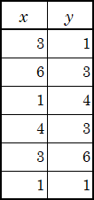

<!-- Edge で 120% で印刷 -->
# Sc106(1) 数学入門 Bクラス 期末試験 (2023)

**学生番号〔　　　　　　　　　　〕，氏名〔　　　　　　　　　　　　　　　　〕**

※ 以下では，$\boldsymbol N を自然数集合，\boldsymbol Z を整数集合，\boldsymbol Q を有理数集合，\boldsymbol R を実数集合とします．$

<!-- 
集合，要素，∈，＝，実数の区間，普遍集合，空集合，部分集合，⊂，
和集合，∪，共通部分，∩，互いに素，集合差，∖，補集合，$A^c$，
要素数，#(A)，直積集合，順序対，類，べき集合
 -->
1. 以下の集合 $A～G$ について，下の問の空欄を適切に埋めなさい．
   なお，普遍集合 $\mathit\Omega$ は $\boldsymbol N$ とします．
   $$
   \left\{\begin{split}
   A&=\{x\,|\,x は奇数\}\\
   B&=\{x\,|\,x は3 の倍数\}\\
   C&=\{x\,|\,2<x<9\}\\
   D&=\{2,3,5,7,11,13\}\\
   E&=B^c\cap C\\
   F&=C\cap D\\
   G&=C\setminus D\\
   \end{split}\right.
   $$

   -  以下の集合の要素を列挙して $(\{1,2,3\}\ のように)$ 表しなさい．
      $$\begin{split}
      C&=\boxed{\rule[-1ex]{0pt}{3ex}\hspace{12em}}\qquad
      E =\boxed{\rule[-1ex]{0pt}{3ex}\hspace{12em}}\\
      F&=\boxed{\rule[-1ex]{0pt}{3ex}\hspace{12em}}\qquad
      G =\boxed{\rule[-1ex]{0pt}{3ex}\hspace{12em}}\\
      (B\cup D)\cap C&=\boxed{\rule[-1ex]{0pt}{3ex}\hspace{12em}}\\
      \end{split}\hspace{6em}$$
   -  $A～G$ のうち，$F$ を部分集合として含むものを，全て列挙しなさい．
      $\boxed{\rule[-1ex]{0pt}{3ex}\hspace{12em}}$
   -  $A～G$ のうち，$G$ と互いに素なものを，全て列挙しなさい．
      $\boxed{\rule[-1ex]{0pt}{3ex}\hspace{12em}}\rule{0pt}{3.5ex}$
   -  集合 $F$ の要素数は $\boxed{\rule[-1ex]{0pt}{3ex}\hspace{3em}}$ であり，集合 $D$
      と集合 $G$ の直積集合の要素数は $\boxed{\rule[-1ex]{0pt}{3ex}\hspace{3em}}\rule{0pt}{3.5ex}$ である．
   -  集合 $E$ の全ての部分集合の数は $\boxed{\rule[-1ex]{0pt}{3ex}\hspace{3em}}$ である．  
      &nbsp;
   <!-- 
   写像（関数），定義域，値域，値，像，f(D)，Im(f)，恒等写像，
   1対1写像 (単射)，上への写像 (全射)，1対1上への写像 (全単射)，
   グラフ，
   合成写像，g∘f，可逆，逆写像，f^-1
   -->

1. 以下の式で表される写像 $f,g,h$ について，下の問に答えなさい．なお，どの写像も
   $\boldsymbol R$ から $\boldsymbol R$ への写像であるとします．
   $$
   \begin{split}
   f(x)&=2x-3\\
   g(x)&=x^2\\
   h(x)&=x^3-x\ (=x(x-1)(x+1))
   \end{split}
   $$
   -  写像 $f,g,h$ のうち，1対1写像（単射）を全て列挙しなさい．
      $\boxed{\rule[-1ex]{0pt}{3ex}\hspace{12em}}$
   -  写像 $f,g,h$ のうち，上への写像（全射）を全て列挙しなさい．
      $\boxed{\rule[-1ex]{0pt}{3ex}\hspace{12em}}\rule{0pt}{3.5ex}$
   -  写像 $f,g,h$ のうち，1対1上への写像（全単射）を全て列挙しなさい．
      $\boxed{\rule[-1ex]{0pt}{3ex}\hspace{12em}}\rule{0pt}{3.5ex}$

   

   ## 〔次ページに続きます〕
   

   -  以下の写像を $x$ を用いた式で表しなさい．
      $$
      \begin{split}
      f\circ g(x) = f(g(x)) = \boxed{\rule[-2ex]{0pt}{5ex}\hspace{16em}}\\
      g\circ f(x) = g(f(x)) = \boxed{\rule[-2ex]{0pt}{5ex}\hspace{16em}}\\
      f^{-1}(x)=\boxed{\rule[-2ex]{0pt}{5ex}\hspace{16em}}
      \end{split}
      $$  

   <!-- 
   真理値，論理式，否定 (￢)，連言 (∧)，選言 (∨)，含意 (⇒)，同値 (⇔)，
   真理値表，(論理的同値)，恒真命題 (恒真式)，矛盾命題 (矛盾式)，
   推論，推論規則，十分条件，必要条件，必要十分条件，
   述語論理，述語，全称限量子，存在限量子，解釈
   -->

1. 命題と論理式に関して，下の問に答えなさい．なお，必要ならば，以下の記号を用いなさい．  
   　　　　$￢$：「～でない」，$∧$：「かつ」，$∨$：「または」，$⇒$：「ならば」，  
   　　　　$⇔$：「ならば，その時に限り」，$∀$：「全ての」「任意の」，$∃$：「ある」「存在する」．
   -  $P =「a は偶数である」$，$Q =「3a は偶数である」$とします．
      -  命題$「a が偶数であるならば，3a は偶数である」$を $P,Q$ を，用いた論理式で表しなさい．  
         $\boxed{\rule[-1ex]{0pt}{3ex}\hspace{12em}}\cdots (A)$
      -  $(A)$ の論理式の逆と対偶と否定を，$P,Q$ を用いた論理式で表しなさい．  
         $逆：\boxed{\rule[-1ex]{0pt}{3ex}\hspace{12em}}\quad
         対偶：\boxed{\rule[-1ex]{0pt}{3ex}\hspace{12em}}$  
         $否定：\boxed{\rule[-1ex]{0pt}{3ex}\hspace{12em}}\rule{0pt}{3.5ex}$
      -  命題$「a が偶数であるならば，その時に限り 3a は偶数である」$を $P,Q$ を用いた論理式で表しなさい．  
         $\boxed{\rule[-1ex]{0pt}{3ex}\hspace{12em}}$
      -  $P$ は $Q$ であることの十分条件であるか，$Yes,\ No$ で答えなさい．
         $\boxed{\rule[-1ex]{0pt}{3ex}\hspace{4em}}$
      -  $P$ は $Q$ であることの必要条件であるか，$Yes,\ No$ で答えなさい．
         $\boxed{\rule[-1ex]{0pt}{3ex}\hspace{4em}}\rule{0pt}{3.5ex}$
   -  $R(x) =「x は猫好きである」$，$S(x) =「x は善人である」$とします．
      -  命題$「猫好きの善人が存在する」$を，$x,R,S$ を用いた論理式で表しなさい．  
         $\boxed{\rule[-1ex]{0pt}{3ex}\hspace{16em}}\cdots (B)$
      -  下の空欄を論理記号を埋めて，$(B)$ の論理式の否定を表す論理式を完成させなさい．  
         $\boxed{\rule[-1ex]{0pt}{3ex}\hspace{1.5em}}\,x
         \left(\lnot R(x)\,\boxed{\rule[-1ex]{0pt}{3ex}\hspace{1.5em}}\,\lnot S(x)\right)$  
         &nbsp;

   <!-- 
   二項演算，閉じている，(交換律，結合律，単位元，逆元，亜群，半群，モノイド，群，可換群)
   -->

1. 以下の二項演算のうち，*閉じていない*ものを全て選び，$a～h$ の記号で列挙しなさい．
   $\boxed{\rule[-1ex]{0pt}{3ex}\hspace{12em}}$

   $(a)\ (\boldsymbol N;\ +)$： 自然数の足し算$\hspace{2em}$
   $(b)\ (\boldsymbol N;\ -)$： 自然数の引き算  
   $(c)\ (\boldsymbol Z;\ +)$： 整数の足し算$\hspace{3.1em}$
   $(d)\ (\boldsymbol Z;\ -)$： 整数の引き算  
   $(e)\ (\boldsymbol Z;\ \times)$： 整数の掛け算$\hspace{3em}$
   $(f)\ (\boldsymbol Z\setminus\{0\};\ \div)$： 0以外の整数の割り算  
   $(g)\ (\boldsymbol Q;\ \times)$： 有理数の掛け算$\hspace{2.1em}$
   $(h)\ (\boldsymbol Q\setminus\{0\};\ \div)$： 0以外の有理数の割り算  
   &nbsp;

   <!-- 
   二項関係，相等関係，全体関係，空関係，逆関係，反射律，対称律，反対称律，推移律，
   同値関係，同値類，商，半順序関係，全順序関係
   -->

   <!-- 
   ベクトル，スカラー，ベクトル和，スカラー積，内積，直交，  
   $x-x_0=at，y-y_0=bt$ or $b(x-x_0)=a(y-y_0)$，  
   $a(x-x_0)+b(y-y_0)=0$，
   -->
   <!-- 
   行列，行，列，i,j-成分，零行列，相等性，和，スカラー積，差，積，
   転置行列，正方行列，単位行列，1次変換，正則，逆行列，行列式，(連立方程式)
   -->

1. $\vec{\vphantom{b}a}=(1,2)$，$\vec b=(2,1)$ として，以下の各々の計算結果を空欄に記しなさい．

   $2\vec{\vphantom{b}a}-\vec b =
   \left(\boxed{\rule[-1ex]{0pt}{3ex}\hspace{2em}},\boxed{\rule[-1ex]{0pt}{3ex}\hspace{2em}}\right)$，　
   $\|2\vec{\vphantom{b}a}-\vec b\| =
   \boxed{\rule[-1ex]{0pt}{3ex}\hspace{2em}}$ (ノルム)，　
   $\langle\vec{\vphantom{b}a},\vec b\rangle=\boxed{\rule[-1ex]{0pt}{3ex}\hspace{2em}}$ (内積)  
   &nbsp;

   

   ## 〔次ページに続きます〕
   

1. ベクトルと行列について，以下の各々の計算結果を空欄に記しなさい．

   $\begin{pmatrix}1&2\\3&4\end{pmatrix}\begin{pmatrix*}[r]3&4\\1&-2\end{pmatrix*}
   =\boxed{\rule[-3ex]{0pt}{7ex}\hspace{6em}}$，　
   $2\cdot\begin{pmatrix}1&2\\3&4\end{pmatrix}-
   \begin{pmatrix*}[r]3&4\\1&-2\end{pmatrix*}=\boxed{\rule[-3ex]{0pt}{7ex}\hspace{6em}}$，  
   $\begin{pmatrix}1&2\\3&4\end{pmatrix}\begin{pmatrix}2\\1\end{pmatrix}
   +\begin{pmatrix}1\\2\end{pmatrix}=\boxed{\rule[-3ex]{0pt}{7ex}\hspace{6em}}\rule{0pt}{5.5ex}$，　
   $\begin{vmatrix}3&1\\5&2\end{vmatrix}=\boxed{\rule[-3ex]{0pt}{7ex}\hspace{6em}}$，  
   $\begin{pmatrix}3&1\\5&2\end{pmatrix}^{-1}=\boxed{\rule[-3ex]{0pt}{7ex}\hspace{6em}}\rule{0pt}{5.5ex}$．  
   &nbsp;

   <!-- 
   質的データ，量的データ，名義尺度，順序尺度，間隔尺度，比例尺度，
   平均値，中央値，最頻値，分散，標準偏差，(標準得点，偏差値)，度数，相対度数，ヒストグラム
   共分散，相関係数，
   -->

1. $1,2,2,3,4,6$ の6つの数値について，以下の代表値を求めて空欄に記しなさい．  
   平均値：$\boxed{\rule[-1ex]{0pt}{3ex}\hspace{4em}}$，　
   中央値：$\boxed{\rule[-1ex]{0pt}{3ex}\hspace{4em}}$，　
   最頻値：$\boxed{\rule[-1ex]{0pt}{3ex}\hspace{4em}}$．  
   &nbsp;

1. 

   右表のデータを用いて，以下の値を計算して空欄に記しなさい．  
   $x\ の平均値\,(\overline x)：\boxed{\rule[-1ex]{0pt}{3ex}\hspace{4em}}$，　
   $x\ の分散\,({s_x}^2)：\boxed{\rule[-1ex]{0pt}{3ex}\hspace{4em}}$，  
   $y\ の平均値\,(\overline y)：\boxed{\rule[-1ex]{0pt}{3ex}\hspace{4em}}$，　
   $y\ の分散\,({s_y}^2)：\boxed{\rule[-1ex]{0pt}{3ex}\hspace{4em}}\rule{0pt}{3.5ex}$，  
   $x,y\ の共分散\,(s_{xy})：\boxed{\rule[-1ex]{0pt}{3ex}\hspace{4em}}\rule{0pt}{3.5ex}$
    (小数第3位で四捨五入)，  
   $x,y\ の相関係数\,\left(\displaystyle\frac{s_{xy}}{s_x\cdot s_y}\right)：
   \boxed{\rule[-1ex]{0pt}{3ex}\hspace{4em}}\rule{0pt}{4ex}$ (小数第3位で四捨五入)．

   <!-- 
   順列，組み合わせ，二項係数，標本空間，事象，和事象，積事象，条件付確率，独立事象，
   確率変数，確率分布，(確率分布の)平均値(期待値)，(確率分布の)分散
   -->
