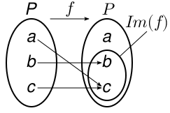
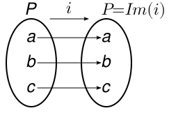
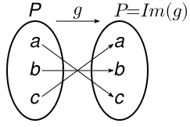

<!--
### 「小テスト：写像(1)」の解説
-->

#### 問題1

$P$の要素のうち，$Im(f)$に含まれるものをすべて選びなさい．

(解)  
右図より，$b,c$ が $Im(f)$ に含まれる．

#### 問題2
$i,f,g,h$のうち，1対1の写像（単射）をすべて選びなさい．

(解)  
　

　
  

上図より，$f$ のみ，$a,c$ が同じ値 $c$ に写像されるが，
それ以外の $i,g,h$ は，異なった値は必ず異なった値に写像されるので，$i,g,h$ が1対1の写像（単射）ということになる．

#### 問題2
$i,f,g,h$のうち，上への写像（全射）をすべて選びなさい．

(解)  
　

　
  

上図より，$f$ のみが，$P≠Im(f)$ だが，
それ以外の $i,g,h$ は，像 $Im(\ldots)$ が$P$と一致しているので，$i,g,h$ が上への写像（全射）ということになる．

#### 〔復習〕
-  1対1の写像（単射）の定義：

   写像 $f:D→R$ と 定義域の任意の要素 $x, x^\prime (∈D)$ について，$x≠x^\prime\ ならば\ f(x)≠f(x^\prime)$ が成り立つ．  
   $(すなわち，「x≠x^\prime\ かつ\ f(x)=f(x^\prime)」となるような\ x,x^\prime\ はない，ということ．)$

-  上への写像（全射）の定義：

   写像 $f:D→R$ において，$R$ と $Im(f)\ (=f(D))$
   が一致する．