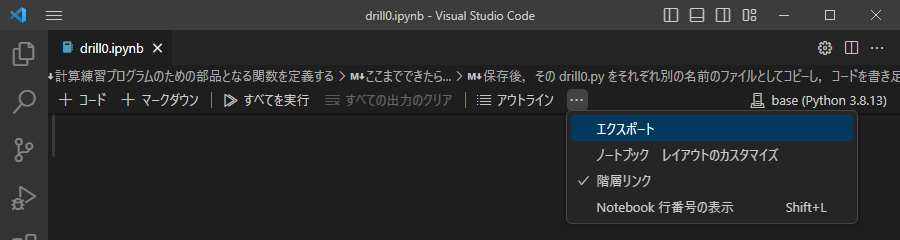
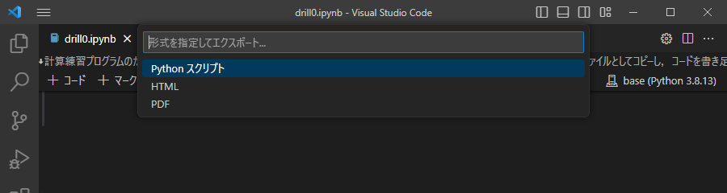

# Jupyterノートブック形式（.ipynb）の エクスポート

Visual Studio Code で，Jupyterノートブック形式（.ipynb）のファイルから
Python のコードを抽出するには，以下の手順で行う．

1. 上のタブの下のメニューの右端の三点メニューから，「エクスポート」を選ぶ．

   

1. 表示された選択肢から，「Python スクリプト」を選ぶ．

   

1. 生成されたタブの内容を，Python ファイルとして，適当な名前で保存する．
   - 拡張子は .py とする．

※ コードセル以外の部分は，コメントとして残されているので，適宜編集してもよい．