
## 流れ図と構造化プログラミング

### 流れ図
プログラムの構造を把握しやすくするために， その「仕事手順」（シナリオのようなもの）を図示することは，一般的に広く行われている． 特に大きくて複雑なプログラムの場合，図を用いずにプログラムの構造を把握することは困難である． そのような目的の図として，古くから 流れ図（フローチャート）が広く使われている．

流れ図とは，処理の内容を書いた箱（図形要素）を， 実行順に線（または矢印）でつないで表したものである． 一般的には，上から下・左から右へ進行するように書くが， 必要に応じて任意の方向に矢印を伸ばしても良い．

処理の内容を書いた箱（図形要素）は，その処理内容に応じて，いくつかの決まった書き方がある．

###### 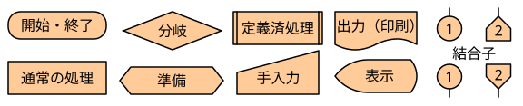

1. 開始と終了 - 両端が丸い図形要素． 流れ図は，必ずこの図形要素で始まり，この図形要素で終わる．
1. 通常の処理 - 四角い箱．通常の様々な処理を記述するのに用いる．
1. 分岐 - 菱形．分岐の条件を記述し，複数の出口（線）を描く．
1. 準備 - 両端が尖った箱．宣言などを記述する場合に用いる．
1. 定義済み処理 - 両端が2重線の箱．関数の呼び出しなどを記述するのに用いる． 
1. 手入力 - 台形．キーボードによる入力などを記述するのに用いる．
1. 出力 - 下が波の箱．印刷などを記述するのに用いる．
1. 表示 - ブラウン管の形(?)．ディスプレイなどへの表示を記述するのに用いる．
1. （ページ内）結合子 - 円
1. 他ページ結合子 - 五角形

個人的に使う分には，ややこしければ上3つ （開始と終了・通常の処理・分岐） で済ませても構わない． 反復（繰り返し）は分岐を用いて記述する．

図が広がりすぎて途中で切りたいときには 結合子 を用いる． 結合子は対で用いられ，線のつながりを表す． 対応する結合子は中に同じ番号を書いて表す．

なお，どの図形要素も，**入口の線は1本しか接続してはいけない**（開始を表す図形要素は除く．開始の図形要素に入口の線はない）．2か所以上から1つの図形要素へ接続する場合は，**入口の直前で線を合流させる**（*箱への入口線を複数にして，箱で合流させてはいけない*）．

###### 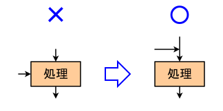

また，分岐の図形要素を除き，どの図形要素も，**出口の線は1本しか接続してはいけない**（終了を表す図形要素も例外．終了の図形要素に出口の線は無い）． 実行を分岐させるときは，必ず**分岐の図形要素を用いて**，分岐の条件を記述する （*分岐以外の図形要素を用いて分岐させてはいけない*）．

###### 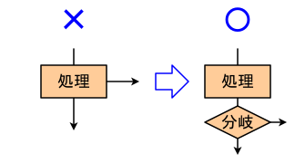

### 構造化プログラミング

#### 基本原理

プログラムの実行順序の構造は，すべて3つの基本的な処理の構造（*順次処理*・*分岐処理*・*反復処理*）の組み合わせで表現ができる．（構造化定理）

#### 段階的詳細化

プログラムの複雑な機能も単純な機能の組み合わせでできていると考え，実現しようとしている（複雑な）機能（部品，モジュール）を，より単純な機能（部品，モジュール)に分解していくことで，プログラムを段階的にだんだん詳細に設計していく設計手法を *段階的詳細化* と呼ぶ．

この考え方に先ほどの構造化の基本原理を組み合わせ，3つの基本的な構造を当てはめながら分解していくのが *構造化プログラミング* である（E. Dijkstra 1968, 1970）．流れ図で考えると，はじめはプログラム全体を一つの（四角の）箱と考え，その箱を段階的に，順次・分岐・反復のいずれかの構造で置き換えていくことで，流れ図を作り上げていくことに相当する．（参考： 「段階的詳細化のパターン」（次項）．また，下の「段階的詳細化の例（計算練習1）」も見よ）

十分に細分化され，分解された各々の処理が一命令で実現できるくらい単純になれば， その単純な処理を行う命令を，分解の逆をたどって組み立てていくことで， プログラムのコード全体を構成することができる．（この作業（プログラムのコードを記述すること）を*コーディング*という）

このような手法を取ることにより，プログラムの構造が整理されて把握しやすくなり，また，読みやすいプログラムを作成することができる．

#### 段階的詳細化のパターン

###### 
- 〔順次処理〕
###### 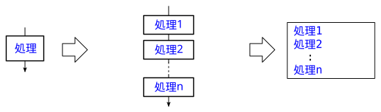
- 〔分岐処理〕
###### 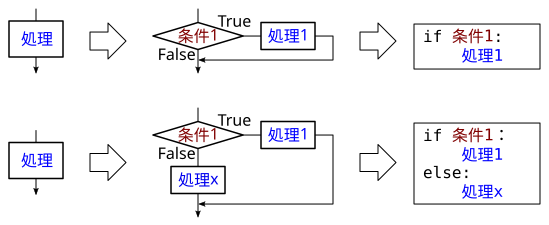
###### 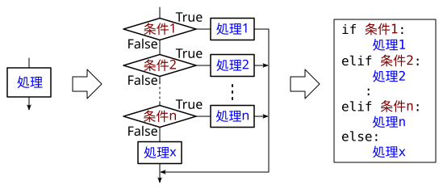
- 〔反復処理〕
###### 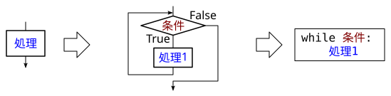
###### 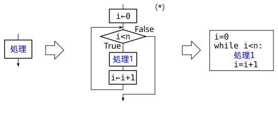
###### 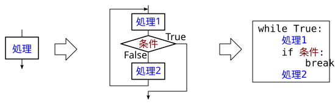

- (*)〔反復処理〕の2つ目のパターンの補足説明
  - 決まった回数（例では $n$回）の反復に用いられる．
    - 変数 `i` の値を $0\ ～\ n-1$ と変えながら反復する，と考えることもできる．
  - 変数は任意の名前でよい（`i` でなくてもよい）．
  - 変数の初期値（例では $0$），反復条件（例では `i<n`），
    反復ごとの変数の更新（例では `i←i+1`）は，さまざまなバリエーションがあり得る．

#### 段階的詳細化の例（計算練習1）

##### プログラムの概要

- 1～10 の自然数の足し算の問題を出題して， 解答を入力させ，正誤をチェックするプログラムを作成する．
- 問題は10問出題するものとする．
- 問題は，random.randint 関数 を用いてランダムに生成する．
- 問題は input 関数を用いて出題し， 答えを入力させる．
- 正誤の判定結果は print 関数を用いる．

##### 詳細化の過程

1. 大まかな流れ図を作成し，段階的に詳細化していく．
   1. 「10回の計算練習」を 1つの処理と考えて，箱1つの流れ図を書く．
   2. 「10回の計算練習」を，「1回の計算練習」を10回反復する処理と考えて詳細化する．  
      （反復処理の2つ目，n回反復のパターン．下図の緑の枠）
   3. 「1回の計算練習」を，「問題作成」「出題と回答入力」「正誤判定」の順次処理と考えて詳細化する．  
      （順次処理のパターン．下図の赤の枠）
   4. 「正誤判定」を正解か否かの条件によって分岐する処理と考えて，詳細化する．  
      （分岐処理の2つ目のパターン．下図の青の枠）
   ###### 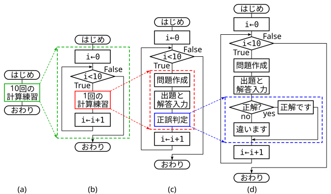
2. それぞれの「箱」の間での情報の流れを考えて用いる変数を決め，
   使用するモジュールなども考えて，流れ図を更に詳細化する．
   (∵「箱」の間の情報伝達は，多くの場合，変数を介して行われるため)

   | 変数 | データ型 | 内容 |
   |:----:|:-------:| ---- |
   | a | int | 足し算の左の数 |
   | b | int | 足し算の右の数 |
   | sol | int | 正解 |
   | prb | str | 問題の数式 "$a$ + $b$"|
   | ans | str | 入力した解答 |

   ###### 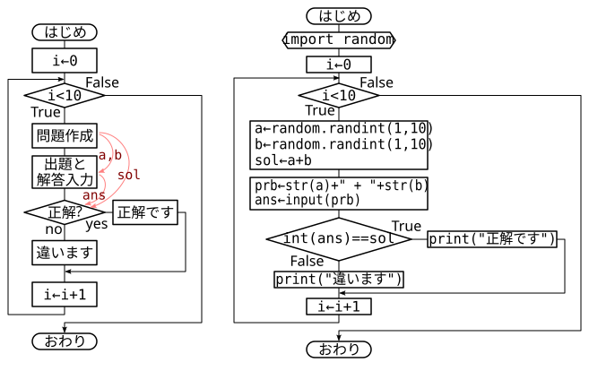  

3. 詳細な流れ図を元にコードを書き下す．

   ###### 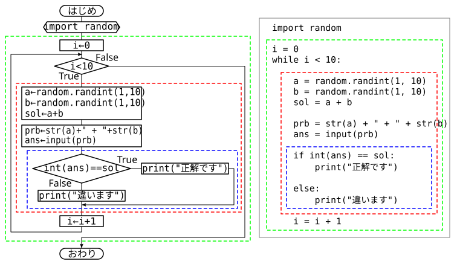  

   -  このプログラムに関しては，Jupyter Notebook 形式のファイル (\*.ipynb) ではなく，
      Python ファイル（\*.py）として作成・実行した方が，入出力がやりやすい．
      -  その場合，`ans = input(prb)` は
         `ans = input(prb + " = ? ")` のようにした方が使いやすい．
   -  Jupyter Notebook 形式のファイル (\*.ipynb) のコードセルに記述して
      VS Code で実行する場合は，`print(⋯)`
      による出力が即座に表示されないことがあるので，引数に `flush=True`
      を付け加えるとよい．
      -  また，`print(prb, "=", ans, "正解です", flush=True)`
         のようにして，問題の数式と解答も表示したほうが見やすくなる．

   [※ 計算練習1のプログラム例 (drill1.py)](drill1.py)

#### 例題1（平方根）

##### プログラムの概要

- 複数個の実数値 (float) を次々入力させ，そのつど，その数の平方根を表示させるプログラムを作成する．
- 0 の入力で終了とする．
- 負の数が入力された場合は，その数の負号を取って正の数にしたものの平方根を用いて，
  その前後に 0 + と i を連結して表示させる．  
  **例：**  
  　-4　⇒　0 + 2.0 i  
  　-2　⇒　0 + 1.4142135623730951 i
- 平方根は math.sqrt 関数を用いて計算をする．
- 入力には input 関数を用いる．
- 結果の出力には print 関数を用いる．

##### ヒント

- 入力が一定の条件が満たすまで処理を繰り返すパターンは，反復処理の3つ目のパターンで書ける．
- 入力の正，負で処理を分けるパターンは，分岐処理の2つ目のパターンで書ける．
- 上の2つはいずれもif文を使うので，うまく書けば1つのif文にまとめられるかも．

#### 例題2（10までの階乗）

##### プログラムの概要
- $1$ の階乗から $10$ の階乗まで，10個の値を順に表示させる．
- $n$ の階乗は，普通に $1$ から $n$ まで順に掛け合わせることで行う．

##### ヒント

- $1$ の階乗から $10$ の階乗まで順に計算・表示させるには，
  $i$ の値を $1 ～ 10$ と変えながら，「$i$ の階乗の計算・表示」を反復すればよい． 
- 「$i$ の階乗の計算」は，$j$ の値を $1 ～ i$ または  $i ～ 1$ と変えながら，
  それらを掛け合わせて求めればよい．
