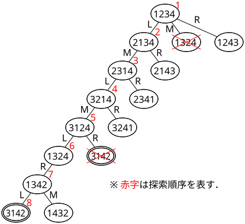
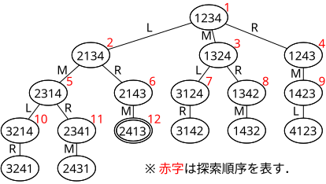

## 4クイーン問題（状態空間グラフバージョン）

### 問題の条件

4×4のマス目の4か所にクイーンを配置する．その際，互いに取り合えないようにする．
（どの2つのクイーンも，縦・横・斜め45度の位置関係にならないようにする．クイーン間の距離は関係ない．）  

### 形式化

1. 4×4のマス目の横の並びを「行」，縦の並びを「列」と呼ぶ．各行は上から
   1, 2, 3, 4 の番号をつけるものとする．
2. 問題の条件より，解においては4つの列すべてにクイーンが1個ずつ置かれるはずである．
   各列におけるクイーンの位置（行の番号）を左の列から順に並べたもので状態を表すものとする．
   (上右図の場合，1423 となる)
3. 問題の条件より，解においては 2. で形式化された状態の4つの番号はすべて異なるはずである．
4. 以上をふまえて，状態集合$V$を以下のように定義する．
   $$
   V\ =\ \{n_1n_2n_3n_4 \mid n_i \in \{1,2,3,4\},\ i \neq j\ ならば\ n_i \neq n_j\}
   $$
5. オペレータ集合は，隣接する列を交換するものとして，$L,M,R$ の3種を考える．
   $$
   \begin{array}{l}
      Op\ =\ \{L,M,R\}\\
      \quad\begin{array}{ll}
      \delta(n_1n_2n_3n_4,L)&=\ \ n_2n_1n_3n_4 & (n_1\,と\,n_2\,の入れ替え)\\
      \delta(n_1n_2n_3n_4,M)&=\ \ n_1n_3n_2n_4 & (n_2\,と\,n_3\,の入れ替え)\\
      \delta(n_1n_2n_3n_4,R)&=\ \ n_1n_2n_4n_3 & (n_3\,と\,n_4\,の入れ替え)\\
      \end{array}
   \end{array}
   $$
6. 初期状態 $s$ を $1234$ とする．また，目標状態の集合 $G$ は以下のようになる．
   $$
   G\ =\ \{n_1n_2n_3n_4 \mid i < j\ ならば，|n_j - n_i| \neq j - i\}
   $$

### 縦型探索による求解

探索した状態の次の状態を $OL$ に追加する際には，適用したオペレータが
$L,M,R$ の順になるようにするものとすると，探索木は以下のようになる．

探索された状態の順序は 1234 → 2134 → 2314 → 3214 → 3124 → 1324 → 1342 → 3142
となり，初期状態から数えて8番目に探索された状態で解 3142 が得られる．

### 横型探索による求解

探索した状態の次の状態を $OL$ に追加する際には，適用したオペレータが
$L,M,R$ の順になるようにするものとすると，探索木は以下のようになる．

探索された状態の順序は 1234 → 2134 → 1324 → 1243 → 2314 → 2143 →
3124 → 1342 → 1423 → 3214 → 2341 → 2413 
となり，初期状態から数えて12番目に探索された状態で解 2413 が得られる．
