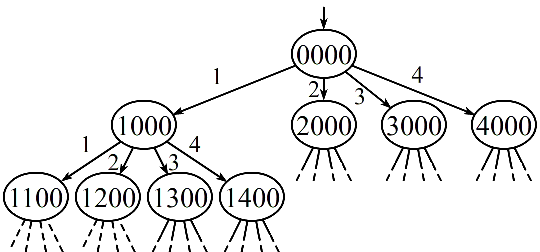

## 4クイーン問題 (木探索バージョン)

### 問題の条件

4×4のマス目の4か所にクイーンを配置する．その際，互いに取り合えないようにする．
(どの2つのクイーンも，縦・横・斜め45度の位置関係にならないようにする．
クイーン間の距離は関係ない)  

### 形式化

1. 4×4のマス目の横の並びを「行」，縦の並びを「列」と呼ぶ．各行は上から 1, 2, 3, 4
   の番号をつけるものとする．
1. 問題の条件より，解においては4つの列すべてにクイーンが1個ずつ置かれるはずである．
   各列におけるクイーンの位置 (行の番号) を左の列から順に並べたもので状態を表すものとする．  
   (クイーンがない場合は 0 とする．上右図の場合，1420 となる)
1. クイーンは，左の列から順に置いて行きながら解を探索するものとする．  
   (最左の 0 の列より右の列はすべて 0 とする) 
1. 以上をふまえて，状態集合$V$を以下のように定義する．
   $$
   V=\left\{n_1n_2n_3n_4 \mid n_i\in\{0,1,2,3,4\},\ 
   n_i=0\ ならば\ j>i\ なる\ j\ に対して\ n_j=0\right\}
   $$
1. オペレータ集合は，最も左の $0$ (クイーンのない列) にクイーンを置くものとして，その位置を表す番号
   $1,2,3,4$ の4種を考える．
   $$
   \begin{array}{l}
      Op\ =\ \{1,2,3,4\}\\
      \quad\begin{array}{lll}
      \delta(0\,0\,0\,0,n)&=\quad n\,0\,0\,0 & (n∈Op)\\
      \delta(n_1 0\,0\,0,n)&=\quad n_1n\,0\,0 & (n_1≠0,\ n∈Op)\\
      \delta(n_1n_2 0\,0,n)&=\quad n_1n_2n\,0 & (n_1,n_2≠0,\ n∈Op)\\
      \delta(n_1n_2n_3 0,n)&=\quad n_1n_2n_3n & (n_1,n_2,n_3≠0,\ n∈Op)\\
      \end{array}
   \end{array}
   $$
1. オペレータの適用条件は，どのオペレータについても $n_4=0$．  
   ($0$ の列が1つでもあれば $n_4=0$ だが，$n_4≠0$ なら $0$ の列はない)
1. 初期状態 $s$ を $0000$ とする．
1. 目標状態の集合は，下の i. ～ iii. の条件を満たす集合$G$となる．
   1. $G ⊂ V$
   1. 任意の $n_1n_2n_3n_4 ∈ G$ について，$n_i≠0$ かつ $n_j≠0\ (i<j)$ ならば，  
      $n_i≠n_j$ かつ $|n_j−n_i|≠j−i$

      $\left(\begin{array}{l}
      i\,番目と\,j\,番目のクイーンが，n_i=n_j\,ならば同じ行にあることになり，\\
      |n_j−n_i|=j−i\,ならば，斜め45度の位置関係にあることになる．
      \end{array}\right)$
   1. 任意の $n_1n_2n_3n_4 ∈ G$ について，$n_1,n_2,n_3,n_4$ のいずれも $0$ でない

#### 状態表現の例
1. &nbsp;
   ###### 

   これは  
   　$|n_3-n_1| = |2-4| = 2 = 3-1\ (= j-i)$  
   　$|n_3-n_2| = |2-1| = 1 = 3-2\ (= j-i)$  
   なので，目標状態集合 $G$ の ii. の条件を満たさない．

1. &nbsp;
   ###### 

   これは  
   　$|n_4-n_3| = |3-2| = 1 = 4-3\ (= j-i)$  
   なので，目標状態集合 $G$ の ii. の条件を満たさない．

1. &nbsp;
   ###### 

   これは  
   　$n_1=n_3$  
   なので，目標状態集合 $G$ の ii. の条件を満たさない．

### 状態空間 (部分)

###### 

-  全体は高さ4の木構造になる．
-  葉 (末端の状態) は $4^4=256$ 個になり，解はその中に含まれる．
-  途中の状態で解の条件 ($G$の ii. の条件) を満たさなくなった場合，その子孫にあたる状態はすべて解の条件を満たさないので，その子孫にあたる部分木は探索しなくてもよい (枝刈り)．

   例えば，$1100$ や $1200$ は，最初の2つのクイーンが互いに取り合える関係にあるので，後2つのクイーンをどこにおいても解にはなりえない．したがって，それらの状態の子孫にあたる状態は探索しなくてもよい．

