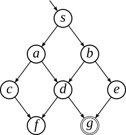
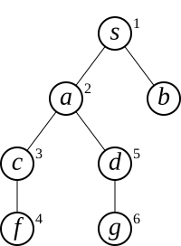
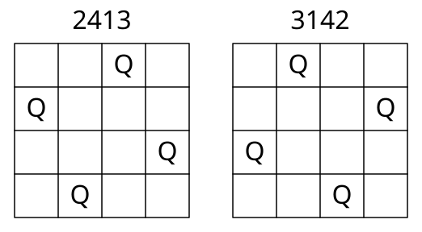

## 小テスト：縦型探索 の解説
状態空間を表す状態遷移図（左）と探索木（右）を示す．また，各変数の推移を下表に示す．

　　　　

|    # | CL              | X    | OL        |
| ---: | --------------- | ---- | --------- |
|    1 | &nbsp;          |&nbsp;| $s$       |
|    2 | &nbsp;          | $s$  | &nbsp;    |
|    3 | $s$             |&nbsp;| $a\ b$    |
|    4 | $s$             | $a$  | $b$       |
|    5 | $s\ a$          |&nbsp;| $c\ d\ b$ |
|    6 | $s\ a$          | $c$  | $d\ b$    |
|    7 | $s\ a\ c$       |&nbsp;| $f\ d\ b$ |
|    8 | $s\ a\ c$       | $f$  | $d\ b$    |
|    9 | $s\ a\ c\ f$    |&nbsp;| $d\ b$    |
|   10 | $s\ a\ c\ f$    | $d$  | $b$       |
|   11 | $s\ a\ c\ f\ d$ |&nbsp;| $g\ b$    |
|   12 | $s\ a\ c\ f\ d$ | $g$  | $b$       |

## 小テスト：4クイーン問題の解
以下の2つです（どちらでも正解です）．

