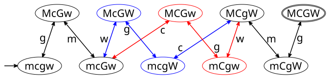

##### 前回の課題（テキスト p.39，問3のパズル： キャベツとヤギとオオカミと男の川渡りパズル）

> キャベツをかついだ男が，オオカミとヤギを連れて川の左岸から右岸へ渡ろうとしている．川には小さな舟が一隻しかないが，この舟には全員が乗ることはできない．
>
> 1. 男以外には，キャベツかオオカミかヤギのどれか一つしか乗せることができない．
> 2. 男がいっしょにいないと，オオカミはヤギを食べてしまう．
> 3. 男がいっしょにいないと，ヤギはキャベツを食べてしまう．
>
> ヤギやキャベツを食べられることなく川を渡る方法を考えよ．

という問題について，以下のように状態を表現するものとする．

- 男，キャベツ，ヤギ，オオカミを，アルファベットの m (man), c (cabbage), g (goat), w (wolf) とし，左岸にいるときは小文字，右岸にいるときは大文字で表すことにして，文字をこの順に並べる．  
- 例えば，mcgw は全員が左岸にいる状態，MCGW は全員が右岸にいる状態，mcGw は，ヤギだけが右岸，それ以外は左岸にいる状態を表す．

1. この問題の初期状態を上の方法でアルファベット4文字で表せ．

   (解) 初期状態は全員が左岸にいる状態なので： **mcgw**

1. この問題の目標状態を上の方法でアルファベット4文字で表せ．

   (解) 目標状態は全員が右岸にいる状態なので： **MCGW**

1. オオカミがヤギを食べてしまったり，ヤギがキャベツを食べてしまったりする状態を*禁止された状態*と呼ぶ．男が右岸にいる禁止された状態は，McgW と MCgw ともう一つあるが，その状態を同じ方法で表せ．

   (解) 男が右岸に，他の全員が左岸にいる状態： **Mcgw**

   - ちなみに，McgW はキャベツとヤギだけ左岸にいる状態， MCgwはヤギとオオカミだけが左岸にいる状態．
   - 男が左岸にいる禁止された状態は，上の大文字小文字を逆にしたもの，mCGW, mCGw, mcGW となる．
   
1. 禁止された状態に遷移することを許さないものとすると，以下の条件が成り立つ：

   -  最初の一手は男がヤギを連れて左岸から右岸に渡るしかない．  
      (それ以外は禁止された状態になってしまう)
   -  最後の (目標状態に到達する) 一手は，やはり男がヤギを連れて左岸から右岸に渡るしかない．  
      (それ以外を仮定すると，その直前の状態は禁止された状態だったことになってしまう)

   したがって，その間で男は，必ず1度はヤギを右岸から左岸に連れ戻す必要がある．ここで問題を分割することを考えよう．男がヤギを連れ戻すとき，その直前の状態ではキャベツとオオカミは同じ岸にはいないと考えてよい．なぜなら：

   -  両方が左岸にいるなら，ヤギを連れ戻すと初期状態に戻ってしまう．
   -  両方が右岸にいるなら，ヤギを連れ戻す前に，すでに目標状態になっている．

   からである．その結果，男がヤギを連れ戻すときの状態遷移は2通りしか考えなくてよい．そのうちの一方
   (どちらでもよい) を，直前の状態と直後の状態をこの順にハイフンでつないで，mcgw-McGw のような形で表せ．

   (解) 男がヤギを連れて右岸から左岸に戻るので，M?G?-m?g? となるはず．キャベツとオオカミは異なった岸にいて移動しないので，?c?W-?c?W または ?C?w-?C?w となるはず．合わせて考えると，正解は **McGW-mcgW** または **MCGw-mCgw** となる．

1. 解を，初期状態から目標状態までの遷移する状態を，その遷移順にハイフンでつないで（mcgw-McGw- … -mCgW-MCGW のように）表せ．

   (解) ここまでの考察から，

   1. 最初の一手は男とヤギが左岸から右岸に渡る： <u>mcgw-McGw</u>
   2. 途中で男とヤギが右岸から左岸に渡る： <u>McGW-mcgW</u> または <u>MCGw-mCgw</u>
   3. 最後の一手は男とヤギが左岸から右岸に渡る： <u>mCgW-MCGW</u>

   は明らか．仮に 2. で McGW-mcgW を採用するなら，McGw と McGW の間と，mcgW と mCgW の間を埋めればよい．

   1. McGw と McGW の間は，オオカミを左岸から右岸に運べばよいので，男だけ左岸に戻ってオオカミを連れて戻ればよい．すなわち： <u>McGw-mcGw-McGW</u>
   1. mcgW と mCgW の間は，キャベツを左岸から右岸に運べばよいので，男がキャベツを運んでから，男だけ戻ればよい．すなわち： <u>mcgW-MCgW-mCgW</u>

   以上より，解は **mcgw-McGw-mcGw-McGW-mcgW-MCgW-mCgW-MCGW**

   ちなみに，もう一つの解は **mcgw-McGw-mcGw-MCGw-mCgw-MCgW-mCgW-MCGW** となる．

※ 以下に状態遷移図（禁止された状態を除く）を示す．

###### 

なお，
- 状態遷移に付された記号は，m が男単独の移動，c,g,w はそれぞれ，キャベツ，ヤギ，オオカミを伴った男の移動を表す．
- 上の状態は男が右岸にいる状態，下の状態は男が左岸にいる状態なので，
  下から上への移動は左岸から右岸への移動，上から下への移動は右岸から左岸への移動を表す．
- 解は左から右へたどるとよい．(赤と青の経路は別解)