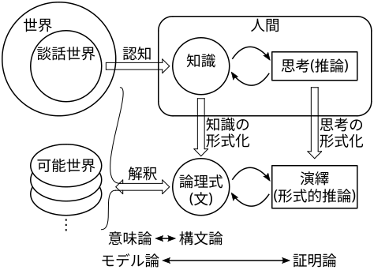

## 知識表現(2): 述語論理の意味論

目次：

[TOC]

先週の図を再掲する．先週は主に構文論の話だったが，今週は意味論（モデル論）の話となる．

###### 

### 第1階述語論理の意味論（モデル論）

論理における意味論（モデル論）とは，構文論で規定された論理式とその構成要素に意味を与える仕組みである．ここでの「意味」は，項に対してはモノやコト，論理式に対しては真理値（$1$／$0$＝$T$／$F$＝真／偽＝true／false）として与えられる．

#### 解釈

論理式（とその構成要素）に意味を与えるものは，<u>解釈</u>と呼ばれる．解釈 $I$ は，今考えようとしている対象（談話世界のモノやコト）全体の集合である<u>対象領域</u> $D$ と，論理式を構成する記号（定数，関数，述語．変数は除く）と $D$ との対応付け（<u>意味関数</u>）からなる．この意味関数は，以下のような対応付けを行う

1. 定数に対しては，$D$ の要素を対応付ける．
2. $n$引数の関数 $f$ に対しては，$D$ の $n$個組から $D$ への関数（$\hat f:D^n\rightarrow D$）が対応付けられる．
3. $n$引数の述語 $P$ に対しては，$D$ の $n$個組から $\{0,1\}$ への関数（$\hat P:D^n\rightarrow \{0,1\}$）が対応付けられる．
   - 特に $n=1$ の時は，$\{d\ |\ d\in D, \hat P(d)=1\}$ という $D$ の部分集合（述語 $P$ を満たす対象の集合）を表すとも考えられる．

このような解釈により，変数を含まない項には $D$ の要素が，変数を含まない原子式には，$1$ か $0$ （真か偽）の値が，一意に対応付けられる．

##### 例 {ignore=true}

以下の定数，関数，述語からなる原子式について考える．

- 定数： $p$，$s$
- 1引数関数： $f$
- 1引数述語： $P$，$G$ 

これらに対して，以下の解釈 $I$ を与えたとする．
$$
\begin{array}{rcl}
D&=&\{\ ソクラテス, プラトン, ソクラテスの父, プラトンの父, \\
 & &\ \ \ ソクラテスの父の父, プラトンの父の父,\ \cdots\}\\
p&\mapsto&プラトン\\
s&\mapsto&ソクラテス\\
f&\mapsto&\hat f:\\
&&\quad\begin{array}{rcl}
    ソクラテス &\mapsto& ソクラテスの父\\
    プラトン &\mapsto& プラトンの父\\
    ソクラテスの父 &\mapsto& ソクラテスの父の父\\
    プラトンの父 &\mapsto& プラトンの父の父\\
    &\vdots&\\
    \end{array}\\
P&\mapsto&\{ソクラテス, プラトン, プラトンの父\}\\
G&\mapsto&\{プラトン, プラトンの父, プラトンの父の父,\cdots\}
\end{array}
$$
この解釈 $I$ のもとで，下の各項，各原子式の意味が与えられる．
$$
\begin{array}{rclcl}
f(s)&\mapsto&\hat f(ソクラテス)&=&ソクラテスの父\\
f(p)&\mapsto&\hat f(プラトン)&=&プラトンの父\\
f(f(p))&\mapsto&\hat f(プラトンの父)&=&プラトンの父の父\\
P(s)&\mapsto&\hat P(ソクラテス)&=&1\\
P(p)&\mapsto&\hat P(プラトン)&=&1\\
P(f(s))&\mapsto&\hat P(ソクラテスの父)&=&0\\
P(f(p))&\mapsto&\hat P(プラトンの父)&=&1\\
P(f(f(p))&\mapsto&\hat P(プラトンの父の父)&=&0\\
G(f(f(p))&\mapsto&\hat G(プラトンの父の父)&=&1\\
\end{array}
$$

#### 変数の作用域（スコープ）

限量式 $\forall x\ \alpha$，$\exists x\ \alpha$ の限量された変数 $x$ の作用域は，この限量式部分に限られる．変数がその変数を限量している限量式に含まれる（作用域内にある）とき，その変数は<u>束縛</u>されている（<u>束縛変数</u>）という．それ以外の変数（限量されていない変数）は<u>自由</u>である（<u>自由変数</u>）という．

ある論理式において，その中に出現する変数がすべて束縛されているとき，その論理式は<u>閉じている</u>（<u>閉式</u>）といい．そうでない（自由変数が存在する）論理式は<u>開いている</u>（<u>開式</u>）という．

開式は，解釈のみでは意味が確定しない（変数が $D$ のどの要素に対応するか定まらない）ので，これ以後閉式のみを考えることとする．

#### 一般の論理式の意味

解釈によって変数を含まない原子式の意味（真偽）が定まると，一般の論理式の意味（真偽）も定まる．解釈 $I$ のもとでの論理式 $\alpha$ の意味を $V_I[\alpha]$ で表すものとすると，論理演算子を用いた論理式の意味は，以下のように定まる．

$$
\begin{array}{rrcll}
    1. &V_I[\lnot α]&=&1-V_I[α]         & ※\ 0,1\ の反転\\
    2. &V_I[α∧β]&=&min(V_I[α],V_I[β])   & ※ V_I[α]=V_I[β]=1\ の時のみ\ 1\\
    3. &V_I[α∨β]&=&max(V_I[α],V_I[β])   & ※ V_I[α]=V_I[β]=0\ の時のみ\ 0\\
    4. &V_I[α→β]&=&max(１－V_I[α],V_I[β])&※ {}=V_I[\lnot α∨β]\\
    5. &V_I[α↔β]&=&\left\{\begin{array}{ll}
                            1 & (V_I[α]=V_I[β])\\
                            0 & (V_I[α]≠V_I[β]) \\
                          \end{array}\right. & ※ {}=V_I[(α→β)∧(β→α)]
\end{array}
$$

これらを表にまとめると以下のようになる．

$$
\begin{array}{|c||c|}\hline
V_I[\alpha] & V_I[\lnot\alpha]
 \rule[-1.5ex]{0em}{4ex}\\\hline
0 & 1\\
1 & 0\\
\hline
\end{array}
$$

$$
\begin{array}{|c|c||c|c|c|c|}\hline
V_I[\alpha] & V_I[\beta]
 & V_I[\alpha\land\beta] & V_I[\alpha\lor\beta]
  & V_I[\alpha\rightarrow\beta] & V_I[\alpha\leftrightarrow\beta]
  \rule[-1.5ex]{0em}{4ex}\\\hline
0 & 0 & 0 & 0 & 1 & 1 \\
0 & 1 & 0 & 1 & 1 & 0 \\
1 & 0 & 0 & 1 & 0 & 0 \\
1 & 1 & 1 & 1 & 1 & 1 \\
\hline
\end{array}
$$

また，限量式は以下のように定まる．

1. $V_I[\forall x\ \alpha]$ は，$\alpha$ 中の（自由な）$x$ に $D$ の要素を対応付けた時に，どの要素を対応付けても $V_I[\alpha]=1$ になるときのみ $1$，それ以外は $0$ となる．（$V_I[\alpha]=0$ となるような $D$ の要素が一つでもあれば $0$ となる）
2. $V_I[\exists x\ \alpha]$ は，$\alpha$ 中の（自由な）$x$ に $D$ の要素を対応付けた時に，どの要素を対応付けても $V_I[\alpha]=0$ になるときのみ $0$，それ以外は $1$ となる．（$V_I[\alpha]=1$ となるような $D$ の要素が一つでもあれば $1$ となる）

##### 例 {ignore=true}

先の例の解釈 $I$ のもとで，以下の各論理式の値が定まる．
$$
\begin{array}{rcl}
V_I[\lnot P(f(p))]&=&1-V_I[P(f(p))]\ =\ 1-1\ =\ 0\\
V_I[P(s)→ G(p)]&=&max(1-V_I[P(s)],V_I[G(p)])\\
                         &=&max(1-1,1)\ =\ max(0,1)\ =\ 1\\
V_I[\lnot G(p)→\lnot P(s)]&=&max(1-(1-V_I[G(p)]),1-V_I[P(s)])\\
                         &=&max(1-(1-1),1-1)\ =\ max(1,0)\ =\ 1\\
\end{array}\\
$$
$$
\begin{array}{l}
V_I[∀ x(P(x)→ P(f(x)))] = 0\\
(∵\ x にソクラテスを対応付けると，V_I[P(x)]=1\ かつ\ V_I[P(f(x))]=0)\\\\
V_I[∀ x(G(x)→ G(f(x)))] = 1\\
(∵\ x に誰を対応付けても，V_I[G(x)]=0\ または\ V_I[G(f(x))]=1)\\
\end{array}
$$

#### 論理式の充足性

論理式の意味（真偽）は解釈によって定まるが，解釈が変われば，一般的には論理式の意味も変わる（例えば，上の例で $s\mapsto \text{プラトン},\ p\mapsto \text{ソクラテス}$ とした場合を考えてみよ）．しかし論理式の中には，どのような解釈のもとでも $1$（真）となるものが存在する．そのような論理式は<u>恒真</u>であるといい，そのような論理式を<u>恒真式</u>と呼ぶ．逆に，どのような解釈のもとでも $0$（偽）となる論理式は<u>恒偽</u>または<u>充足不能</u>であるといい，そのような論理式は<u>恒偽式</u>または<u>矛盾式</u>と呼ぶ．また， $1$（真）となる解釈が少なくとも1つ存在するような論理式は<u>充足可能</u>であるという．恒真式は当然充足可能でもある．

全ての（閉じた）論理式は，以下のいずれかに該当する．（cf. p.45，fig.3.1）

1. 恒真（どのような解釈のもとでも $1$（真）となる）
2. 充足可能だが恒真ではない（解釈によって $1$（真）となったり $0$（偽）となったりする）
3. 充足不能（どのような解釈のもとでも $0$（偽）となる）

#### 論理的帰結

$\Gamma$ を前提集合（論理式の集合，すべてが $\land$ で結合された一つの論理式と考えてもよい）としたとき，$\Gamma$ のすべての論理式を $1$（真）とするすべての解釈に対して $1$（真）となるような論理式 $\alpha$ を $\Gamma$ の<u>論理的帰結</u>といい，$\Gamma\models\alpha$ と表記する．（直観的には，$\Gamma$ 中のすべての論理式が成り立つ「世界」では，$\alpha$ もまた成り立つということを表す）

この $\Gamma$ は解釈を限定する（$\Gamma$ 中のいずれかの論理式を $0$（偽）とするような解釈を除外する）働きがあるが，無前提（前提が空集合）の場合，解釈をまったく限定しないことになるので，無前提に対する論理的帰結は恒真であることと同じである．そのため，$\alpha$ が恒真であることを $\models\alpha$ と表記することもある．

#### 論理式の同値性

2つの論理式 $\alpha,\beta$ が，すべての解釈において同じ意味を持つとき，すなわち，
$$
\forall I,\; V_I[\alpha]=V_I[\beta]
$$
が成り立つとき，$\alpha$ と $\beta$ は<u>同値</u>であるといい，$\alpha=\beta$ と表す．同値性と論理的帰結の間には，以下の関係が成り立つ．
$$
\alpha=\beta\quad ならば，その時に限り
\quad\alpha\models\beta\ かつ \ \beta\models\alpha
$$
同値な論理式は同じ意味を持つので，論理式内で置き換えても全体の意味は変わらない．そのため，論理式の意味を変えずに変換（変形）するのに用いられる．（<u>同値変換</u>と呼ばれる）

良く知られている論理式の同値性はテキストにまとめられているので，参照しておくこと．  
（p.47，表3.7； p.63，表3.9）

※ 表中の $\boldsymbol T,\boldsymbol F$ は，各々恒真，恒偽を表す記号である，（各々 $\lnot P\lor P, \lnot P\land P$ の略記と考えてもよい）

