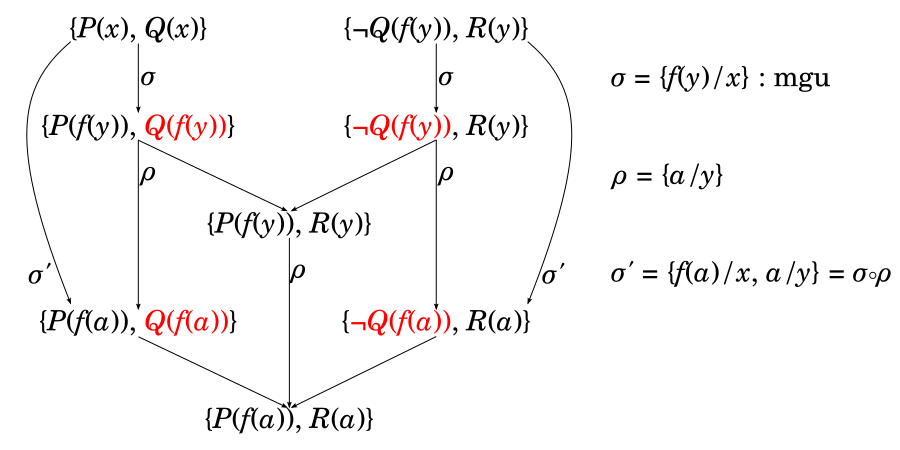

## 知識表現(4): 融合原理による証明系（つづき）

目次：

[TOC]

### 推論規則としての代入

上に見たように節形式においては，自由変数は全称限量されているものと解釈される．したがって，論理式 $\alpha$ が真ならば，任意の代入 $\sigma$ に対して，$\alpha\sigma$ も真となる（$\alpha\sigma$ は $\alpha$ の論理的帰結，$\alpha\models\alpha\sigma$）．これは，いわゆる<u>直接推論</u>に相当する．

#### 例： {ignore=true}
  $$
  \left\{\begin{array}{rcl}
      s&:&ソクラテス\\
      f(x)&:&(x の)\,父親\\
      P(x)&:&(x は)\,哲学者である\\
    \end{array}\right.
  $$
  とする．（以下，人について考えているものと仮定する）

代入 $\sigma$ を $\sigma=\{s/x\}$ とすると，

$
\begin{array}{ll}
P(x)&:「全ての人は哲学者である」\\
P(x)\sigma=P(s)&:「ソクラテスは哲学者である」
\end{array}
$

また，代入 $\sigma, \rho$ を $\sigma=\{f(y)/x\}$，$\rho=\{s/y\}$ とすると，

$
\begin{array}{rcll}
P(x)\sigma&=&P(f(y)) &:「(全ての人(y)について，その)\ 父は哲学者である」\\
P(x)(\sigma\circ\rho)&=&(P(x)\sigma)\rho\\
&=&P(f(y))\rho\\
&=&P(f(s)) &:「ソクラテスの父は哲学者である」
\end{array}
$

となる．このとき，$P(x),\ P(f(y)),\ P(f(s))$ を比べると，前者の方が<u>より一般的(more general)</u>な内容（「すべての $x$ について……」）を持っており，後者になるほど範囲が限定される（「$f(y)$ で表せるすべてのものについて……」，「$f(s)$ について……」）．

一般に任意の論理式 $\alpha$ と任意の代入 $\sigma,\rho$ について，$\alpha(\sigma\circ\rho)=(\alpha\sigma)\rho$ より $\alpha\sigma$ が一般的であり，$\alpha\sigma$ より $\alpha$ が一般的であるため，代入についても，$\sigma$ の方が $\sigma\circ\rho$ <u>より一般的(more general)</u>であるという． 

### 融合原理（導出原理）による証明系

融合原理（導出原理）による証明系は，第1階述語論理の証明系として完全性（後述）を持ち，コンピューターを用いて推論するのに適しているため，論理を用いたAIシステムでは広く使われている．

#### 融合原理（導出原理） ― 単一化を用いない場合

融合原理（導出原理）は，（単一化（後述）を用いない場合）互いに相補なリテラルを含む2つの節から1つの節を導く，以下のような推論規則である．

- $A$ を原子式，$L_{11},\cdots,L_{1n},L_{21},\cdots,L_{2m}$ をリテラル とし，互いに相補なリテラル $A, \lnot A$ の各々を含む2つの節 $\mathcal C_1, \mathcal C_2$ を以下のように定める．
  $$
  \mathcal C_1=\{L_{11},\cdots,L_{1n},\lnot A\},\quad
  \mathcal C_2=\{A,L_{21},\cdots,L_{2m}\}
  $$
  このとき，この2つの節 $\mathcal C_1, \mathcal C_2$ から相補なリテラルを取り除いて融合した節（融合節（導出節））$\mathcal C$：

  $$
\begin{array}{rcl}
  \mathcal C&=&(\mathcal C_1\setminus\{\lnot A\})\cup(\mathcal C_2\setminus\{A\})\\
  &=&\{L_{11},\cdots,L_{1n}\}\cup\{L_{21},\cdots,L_{2m}\}\\
  &=&\{L_{11},\cdots,L_{1n},L_{21},\cdots,L_{2m}\}
  \end{array}
  $$
  を導く推論規則を<u>融合原理</u>（<u>導出原理</u>）という．

##### 例： {ignore=true}

- $\mathcal C_1=\{Q,\underline{\lnot P}\},\ \mathcal C_2=\{\underline{P}\}\quad\vdash\quad\mathcal C=\{Q\}$

  $\mathcal C_1$ は $P\to Q$ と同値なので，いわゆる肯定式 (modus ponens) と同等．
- $\mathcal C_1=\{\underline{\lnot Q}\},\ \mathcal C_2=\{\underline{Q},\lnot P\}\quad\vdash\quad\mathcal C=\{\lnot P\}$

  $\mathcal C_2$ は $P\to Q$ と同値なので，いわゆる否定式 (modus tollens) と同等．
- $\mathcal C_1=\{R,\underline{\lnot Q}\},\ \mathcal C_2=\{\underline{Q},\lnot P\}\quad\vdash\quad\mathcal C=\{R, \lnot P\}$

  $\mathcal C_2,\mathcal C_1,\mathcal C$ は各々 $P\to Q,Q\to R,P\to R$ と同値なので，いわゆる三段論法 (syllogism) と同等．

#### 単一化

そのままでは相補なリテラルではない（原子式部分が異なる）正，負リテラルも，代入（置換）によって相補なリテラルにできる（原子式部分を一致させられる）ことがある．このように2つの式（原子式）を代入によって一致させることを<u>単一化</u>という．

- 2つの式 $\alpha_1,\alpha_2\ (\alpha_1\not=\alpha_2)$ について，$\alpha_1\sigma=\alpha_2\sigma$ となるような代入 $σ$ が存在するとき，$\alpha_1$ と $\alpha_2$ は<u>単一化可能</u>であるといい，その代入を<u>単一化代入</u>（<u>単一化作用素</u>，<u>ユニファイア (unifier)</u>）という．

- $\sigma$ が $\alpha_1,\alpha_2$ の単一化代入とするとき，任意の代入 $\rho$ に対して，$\sigma\circ\rho$ もまた単一化代入となる．

  $(\because \alpha_1\sigma=\alpha_2\sigma$ より  $\alpha_1(\sigma\circ\rho)=(\alpha_1\sigma)\rho=(\alpha_2\sigma)\rho=\alpha_2(\sigma\circ\rho))$

- $\sigma$ が $\alpha_1,\alpha_2$ の単一化代入であり，ある代入 $\rho$ によって $\sigma=\sigma^\prime\circ\rho$ となるような（$=\sigma$ より一般的な）単一化代入 $\sigma^\prime$ が存在*しない*とき，$\sigma$ は<u>最汎単一化代入</u>（<u>最汎単一化作用素</u>，<u>mgu</u> (<u>most general unifier</u>)）という．

- 2つの式の単一化アルゴリズム（与えられた2つの式が単一化可能かどうかを判定し，可能な場合はその mgu を求めるアルゴリズム）が知られているが，授業では割愛する．

- *第1階述語論理の論理式の場合*，いかなる2つの式に対しても，*mgu は存在するなら唯一*であり，mgu 以外のすべての単一化代入よりも一般的 (more general) である．

  （$\sigma$ が $\alpha_1,\alpha_2$ の mgu である場合， $\alpha_1,\alpha_2$ の任意の単一化代入は，ある代入 $\rho$ を用いて $\sigma\circ\rho$ の形に表せる）

- 3つ以上の式の単一化も，2つずつ単一化することにより，容易に拡張できる．

#### 融合原理（導出原理） ― 一般的な場合

単一化を用いた一般的な融合原理（導出原理）は以下のように記述できる．

- $\widehat{\mathcal C}_1,\widehat{\mathcal C}_2$ を節，$A_{11},\cdots,A_{1n},A_{21},\cdots,A_{2m}$ を単一化可能な原子式とし，2つの節 $\mathcal C_1,\mathcal C_2$ を以下のように定める．
  $$
  \mathcal C_1=\widehat{\mathcal C}_1\cup\{¬A_{11},\cdots,¬A_{1n}\},\quad
  \mathcal C_2=\widehat{\mathcal C}_2\cup\{A_{21},\cdots,A_{2m}\}
  $$
  $A_{11},\cdots,A_{1n},A_{21},\cdots,A_{2m}$ の mgu を $\sigma$ とし，$\sigma$ で単一化した結果の原子式を $A$ とすると，
  $$
  A_{11}σ=\cdots=A_{1n}σ=A_{21}σ=\cdots=A_{2m}σ=A
  $$
  となり，$\mathcal C_1,\mathcal C_2$ に $σ$ を適用することで（単一化を用いない場合の）融合原理（導出原理）が適用でき，
  $$
  \mathcal C_1σ=\widehat{\mathcal C}_1 σ\cup\{¬A\},\quad
  \mathcal C_2σ=\widehat{\mathcal C}_2 σ\cup\{A\}
  $$
  から，以下のように融合節（導出節）$\mathcal C$ を得る．
  $$
  \mathcal C=\widehat{\mathcal C}_1 σ\cup\widehat{\mathcal C}_2 σ
  =(\widehat{\mathcal C}_1\cup\widehat{\mathcal C}_2)σ
  $$

- 原理的には，mgu でない単一化代入 $σ^\prime$ を用いても，同様に融合節（導出節）$\mathcal C^\prime$ が得られる．
  $$
  A_{11}σ^\prime=\cdots=A_{1n}σ^\prime=A_{21}σ^\prime=\cdots=A_{2m}σ^\prime=A^\prime\\
  \mathcal C_1σ^\prime=\widehat{\mathcal C}_1 σ^\prime\cup\{¬A^\prime\},\quad
  \mathcal C_2σ^\prime=\widehat{\mathcal C}_2 σ^\prime\cup\{A^\prime\}\\
  \downarrow\\
  \mathcal C^\prime=\widehat{\mathcal C}_1 σ^\prime\cup\widehat{\mathcal C}_2 σ^\prime
  =(\widehat{\mathcal C}_1\cup\widehat{\mathcal C}_2)σ^\prime
  $$
  しかしながら，先の単一化の議論より，$σ^\prime$ には，$σ^\prime=σ\circρ$ となる代入 $ρ$ が存在する．この $ρ$ を用いると，$\mathcal C^\prime$ は以下のように表せる．
  $$
  \mathcal C^\prime=(\widehat{\mathcal C}_1\cup\widehat{\mathcal C}_2)σ^\prime
  =(\widehat{\mathcal C}_1\cup\widehat{\mathcal C}_2)(σ\circρ)
  =((\widehat{\mathcal C}_1\cup\widehat{\mathcal C}_2)σ)ρ
  =\mathcal Cρ
  $$
  すなわち，$\mathcal C^\prime$ は $\mathcal C$ に含意される（$\mathcal C$ からただちに直接推論できる）．

  したがって，融合原理（導出原理）を（一般的な形で）用いる場合，常に mgu を使うべきである．

##### 〔参考〕 {ignore=true}

#### 融合演繹（導出演繹）

（前提となる）節形式（節集合）$\mathcal S$，と節 $\mathcal C$ について，以下の条件を満たす節の列 $\mathcal C_1,\cdots,\mathcal C_n$ を $\mathcal C$ の $\mathcal S$ からの<u>融合演繹</u>（<u>導出演繹</u>）という．

- 各 $\mathcal C_i$ は以下のいずれかである．
  - $\mathcal C_i\in\mathcal S$
  - $\mathcal C_i$ は $\mathcal C_1,\cdots,\mathcal C_{i-1}$ のうちの2つの節から融合原理（導出原理）によって導かれる融合節（導出節）である．
- $\mathcal C_n=\mathcal C$ である．

融合演繹も演繹の一種なので， $\mathcal C$ の $\mathcal S$ からの融合演繹が存在するなら， $\mathcal C$ は $\mathcal S$ から<u>（融合）演繹可能</u>であるといい，$\mathcal S\vdash\mathcal C$ と表現する．

##### 例： {ignore=true}

- 前提（節集合） $\mathcal S$ を以下のように定めて融合演繹を行う．
  $$
  \begin{array}{rcll}
  \mathcal S=&\{&
    \{Lier(x),¬Loose(x),¬Man(x)\},\quad&(a)\text{「ルーズな男は嘘つきである」}\\
  &&\{Loose(y),¬Roman(y)\},            &(b)\text{「ローマ人はルーズである」}\\
  &&\{Roman(Seneca)\},                 &(c)\text{「セネカはローマ人である」}\\
  &&\{Man(Seneca)\}                    &(d)\text{「セネカは男である」}\\
  &\}
  \end{array}
  $$
  融合演繹：
  $$
  \begin{array}{rcll}
  1&:&\{Lier(x),¬Loose(x),¬Man(x)\}       &(a)\\
  2&:&\{Man(Seneca)\}                     &(d)\\
  3&:&\{Lier(Seneca),¬Loose(Seneca)\}\quad&1,2; σ_1=\{Seneca/x\}\\
  4&:&\{Loose(y),¬Roman(y)\}              &(b)\\
  5&:&\{Lier(Seneca),¬Roman(Seneca)\}      &3,4; σ_2=\{Seneca/y\}\\
  6&:&\{Roman(Seneca)\}                   &(d)\\
  7&:&\{Lier(Seneca)\}                    &5,6; σ_3=\phi
  \end{array}
  $$
  ※ 結論 $\mathcal C=\{Lier(Seneca)\}$ 「セネカは嘘つきである」が得られた．

#### 反駁と背理法

##### 空節

（リテラルの）空集合を節とみなして<u>空節</u>と呼ぶ．空節は真になるリテラルを一つも含まないので，恒偽式（矛盾）に対応する．実際，融合原理による推論で融合節が空節になるのは，相補リテラルのみを含む節同士で融合を行った場合，すなわち，$\{¬A\}$ と $\{A\}$ で融合を行った場合であり，これは $¬A$ と $A$ が同時に成り立つことを意味し，明らかに矛盾である．

空節は，慣習的に $□$ で表す．

##### 反駁

前提（節集合） $\mathcal S$ からの融合演繹の結論が空節であるとき，その演繹は<u>反駁</u>と呼ばれる．このとき，$\mathcal S$ は<u>反駁可能</u>であるといい，$\mathcal S\vdash□$ と表現する．健全な証明系においては，$\mathcal S$ が反駁可能であるなら，$\mathcal S$ は充足不能（恒偽）である（そして，融合原理による証明系は健全な証明系である）．

##### 背理法

証明したい命題 $α$ の否定命題 $¬α$ が充足不能であるなら，元の命題 $α$ は恒真となるから，$¬α$ を反駁することにより，$α$ を証明することができる．これを<u>背理法</u>という．

また，第1階述語論理において $Γ\modelsα$ と $\modelsΓ\toα$ は等価であり，その右辺の否定 $¬(Γ→α)$$=¬(¬Γ∨α)$$=Γ∧¬α$ が充足不能であることとも等価である．したがって，$Γ∧¬α$ を節形式  $\mathcal S$ に変換して反駁することは，モデル論において $Γ\modelsα$ を示すことに等しい．（前の段落の背理法の説明は，この段落の $Γ$ が空だった場合に相当する）

※ $Γ∧¬α$ を節形式に変換する場合，$Γ$ と $¬α$ は連言 (and) なので，$Γ$ と $¬α$ 別々に節形式に変換し（各々 $\mathcal S_Γ,\mathcal S_{¬α}$ とする）それらの合併集合を $\mathcal S$ としてもよい．$(\mathcal S=\mathcal S_Γ∪\mathcal S_{¬α})$

※ 別紙（「融合原理による反駁の例」）に例を示す．

#### 証明系の健全性・完全性

一般的には，証明系の健全性・完全性は，モデル論における恒真 $\models\alpha$ と，証明論における証明可能性 $\vdash\alpha$ の関係によって定まる．

- *健全性*： 任意の論理式 $\alpha$ について，$\alpha$ が証明可能（$\vdash\alpha$）ならば $\alpha$ は恒真（$\models\alpha$）であるということ．
  - 恒真であっても証明できるとは限らないが，*証明されたならば恒真であ*るということ．
- *完全性*： 任意の論理式 $\alpha$ について，$\alpha$ が証明可能（$\vdash\alpha$）ならば $\alpha$ は恒真（$\models\alpha$）であり，
  かつ，$\alpha$ が恒真（$\models\alpha$）ならば $\alpha$ は証明可能（$\vdash\alpha$）であるということ．
  - 健全性に加えて，*恒真であれば必ず証明できる*ということ．

融合原理（導出原理）を用いた証明系は反駁による証明系なので，以下のように考える．

- 健全性： 任意の論理式 $\alpha$ について，$\neg\alpha$ を節集合に変換したもの（$\mathcal S_{\neg\alpha}$）が反駁可能（$\mathcal S_{ \neg\alpha}\vdash\square$）ならば $\alpha$ は恒真（$\models\alpha$）であるということ．
- 完全性： 任意の論理式 $\alpha$ について，$\neg\alpha$ を節集合に変換したもの（$\mathcal S_{\neg\alpha}$）が反駁可能（$\mathcal S_{\neg\alpha}\vdash\square$）ならば $\alpha$ は恒真（$\models\alpha$）であり，かつ，$\alpha$ が恒真（$\models\alpha$）ならば $\mathcal S_{\neg\alpha}$ は反駁可能（$\mathcal S_{\neg\alpha}\vdash\square$）であるということ．

実際，証明は省略するが，第1階述語論理の融合原理（導出原理）を用いた証明系は，健全かつ完全である．

## （付録）ホーン節と線形導出

- 正リテラルを高々1つしか含まない節を<u>ホーン節</u>と呼ぶ．

  - 負リテラルのみを（1つ以上）含む節を特に<u>負節</u>と呼ぶ．
  - 正リテラルを（ちょうど）1つ含む節を特に<u>確定節</u>と呼ぶ．
    - 確定節のうち，負リテラルを含まないもの（正リテラル1つだけの節）を特に<u>正単位節</u>と呼ぶ．

  負節と確定節から融合原理（導出原理）を用いて導かれる融合節（導出節）は，必ず負節または空節となる。

  - 正単位節は負節の負リテラルの1つを消去する働きがある．
  - それ以外の確定節は，負節の負リテラルの1つを，1つ以上の別の負リテラルで置き換える働きがある．

- プログラミング言語 Prolog に代表される論理型プログラミング・パラダイムは，原理的には，確定節の集合を前提（プログラムに相当する）とし，「解が存在しない」（「解が存在する」の否定）を表す負節（プログラムの呼び出しに相当し，<u>ゴール</u>と呼ばれる）を反駁することにより，反例として解を得るものである．

- 形式的には，ゴールからスタートして、次々と（前提（＝プログラム）に含まれる）確定節との間で融合原理による融合を繰り返し，最終的にすべての負リテラルを消去して空節に至るというプロセスをたどる。

- Prolog において用いられるこのような融合演繹は<u>線形融合</u>（<u>線形導出</u>），厳密には<u>SLD融合</u>（<u>SLD導出</u>）と呼ばれる（SLD = Selective Linear Resolution for Definite Clause）．

※ 別紙（「融合原理による反駁の例」）の例は，この線形融合（線形導出）になっている．