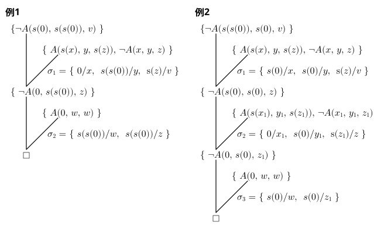

## 融合原理による反駁の例

### 例1

$0$：（ゼロを表す）個体定数

$s$：（「次の数」を表す）関数記号

$0,\ 1,\ 2,\ 3,\ \cdots$　⇒　$0,\ s(0),\ s(s(0)),\ s(s(s(0))),\ \cdots$  
（$s(\cdots)$ の重なる数が「数」を表す）

$A$：（加算を表す）述語記号： $A(x,y,z)$ は $x+y$ が $z$ に等しいことを表す．

前提 $\Gamma = \{\ \forall w\,A(0, w, w), \ \forall x \forall y \forall z\,(A(x, y, z)\rarr A(s(x), y, s(z)))\ \}$  
　　（加算の定義を表す．「$0+w=w$」かつ「$x+y=z\ ならば\ s(x)+y=s(z)$」）

結論 $\alpha = \exist v\,A(s(0), s(s(0)), v)$  
　　（「$1+2$ に等しい $v$ が存在する」）

　　（ $\lnot\alpha = \forall v\ \lnot A(s(0), s(s(0)), v)$ ）

$\Gamma\models\alpha$ を示すために，$\lnot(\Gamma\rarr\alpha)$ を節形式に変換して反駁する．

$\lnot(\Gamma\rarr\alpha)  \equiv \Gamma\land\lnot\alpha$ より，$\Gamma$ と $\lnot\alpha$ を別個に節形式 $\mathcal S_\Gamma$ と $\mathcal S_{\lnot\alpha}$ に変換すると，

$\begin{array}{rlll}\mathcal S_\Gamma = \{&\{\ A(0, w, w)\ \},&&\cdots (1)\\
&\{\ A(s(x), y,s(z)),\ \lnot A(x, y, z)\ \}&\}&\cdots (2)\\
\mathcal S_{\lnot\alpha}=\{&\{\ \lnot A(s(0), s(s(0)), v)\ \}&\}&\cdots (3)\end{array}$

$\mathcal S_\Gamma\cup\mathcal S_{\lnot\alpha}$からの反駁は以下の通り．
$$
\begin{array}{rll}
1.\ &\{\ \underline{\lnot A(s(0), s(s(0)), v)}\ \}			&(3)\\
2.\ &\{\ \underline{A(s(x), y,s(z))},\ \lnot A(x, y, z)\ \}	&(2)\\
3.\ &\{\ \underline{\lnot A(0, s(s(0)), z)}\ \}
   &1,2;\ \sigma_1=\{\ 0/x,\ s(s(0))/y,\ s(z)/v\ \}\\
4.\ &\{\ \underline{A(0, w, w)}\ \}	&(1)\\
5.\ &\square & 3,4;\ \sigma_2=\{\ s(s(0))/w,\ s(s(0))/z\ \}
\end{array}
$$
※ 反例としての $v$ の値 $(v\sigma_1)\sigma_2=s(s(s(0)))$ が加算の解（$3$ を表す）

### 例2

例1と同じ $\Gamma$ を用いて，

結論 $\alpha = \exist v A(s(s(0), s(0), v)$ 　　（「$2+1$ に等しい $v$ が存在する」）

として同様に節形式に変換．

$\begin{array}{rlll}\mathcal S_\Gamma = \{&\{\ A(0, w, w)\ \},&&\cdots (1)\\
&\{\ A(s(x), y, s(z)),\ \lnot A(x, y, z)\ \}&\}&\cdots (2)\\\mathcal
S_{\lnot\alpha}=\{&\{\ \lnot A(s(s(0)), s(0), v)\ \}&\}&\cdots (3)\end{array}$

$\mathcal S_\Gamma\cup\mathcal S_{\lnot\alpha}$からの反駁は以下の通り．
$$
\begin{array}{rll}
1.\ &\{\ \underline{\lnot A(s(s(0), s(0), v)}\ \}				&(3)\\
2.\ &\{\ \underline{A(s(x), y, s(z))},\ \lnot A(x, y, z)\ \}	&(2)\\
3.\ &\{\ \underline{\lnot A(s(0), s(0), z)}\ \}
   &1,2;\ \sigma_1=\{\ s(0)/x,\ s(0)/y,\ s(z)/v\ \}\\
4.\ &\{\ \underline{A(s(x_1), y_1, s(z_1))},\ \lnot A(x_1, y_1, z_1)\ \}
   &(2)（変数の混同を避けるため名前替えしている）\\
5.\ &\{\ \underline{\lnot A(0, s(0), z_1)}\ \}
   &3,4;\ \sigma_2=\{\ 0/x_1,\ s(0)/y_1,\ s(z_1)/z\ \}\\
6.\ &\{\ \underline{A(0, w, w)}\ \}	&(1)\\
7.\ &\square & 5,6;\ \sigma_3=\{\ s(0)/w,\ s(0)/z_1\ \}
\end{array}
$$
※ 反例としての $v$ の値は  $((v\sigma_1)\sigma_2)\sigma_3=s(s(s(0)))$ （$3$ を表す）

### 〔補足〕

-  上の例で用いた

   $\begin{array}{rlll}\mathcal S_\Gamma = \{&\{\ A(0, w, w)\ \},&&\cdots (1)\\
   &\{\ A(s(x), y, s(z)),\ \lnot A(x, y, z)\ \}&\}&\cdots (2)\\\mathcal
   S_{\lnot\alpha}=\{&\{\ \lnot A(s(s(0)), s(0), v)\ \}&\}&\cdots (3)\end{array}$

   の節はすべてホーン節になっている．
- 例1 も例2 も，SLD融合の例となっている．（下の演繹木を参照）

  