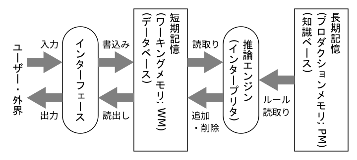

## 知識表現(4): プロダクションルール

目次：

[TOC]

### 知識表現

- 宣言的知識

  事実に係わる知識 (knowing that)．「何であるか」についての知識．叙述的な知識．「○○は××である」というような知識．百科事典的．

  - 第1階述語論理（§3.1～3.3，§4.2）… 既述
  - 意味ネットワーク（§4.3）
  - フレーム（§4.3）（→ オブジェクト）  
  &nbsp;

- 手続き的知識

  行為・技能にかかわる知識 (knowing how)．「どうやって」についての知識．方法論的な知識．「○○をするには××すればよい」というような知識．ハウツー本的．

  - プロダクションルール（§4.1）

※ 宣言的知識と手続き的知識は，厳密に区別できるものでもない．同じ知識表現であっても，  
　 宣言的なものとして利用したり，手続き的なものとして利用したりすることもありうる．

※ 以下，いくつかの知識表現を紹介していく．

### プロダクションシステム（§4.1）

- ルールベース・システムとも呼ばれ，知識としてプロダクションルールを用いる．
- エキスパートシステムと呼ばれる質問応答システムとして多く研究されてきたが，一定の汎用性を持ち，実時間的なロボット制御等にも用いられている．

#### プロダクションシステムの構造

- *短期記憶* (*WM*)

  *WM要素*（後述）の集合として，「事実」（*ファクト*; 後述）や推論の途中経過を記憶する．主に*推論エンジン*によって，WM要素単位で追加・削除されることにより，順次書き換えられていく．*ワーキングメモリ*，*データベース*とも呼ばれる．  
  &nbsp;

- *インターフェース*

  ユーザーや外部とのやり取りを行う．ユーザーや外部からの入力は，WM要素として（多くの場合初期値として）短期記憶に書き込まれ，推論結果のWM要素を元に出力を生成する．  
  &nbsp;

- *推論エンジン*

  短期記憶（のWM要素）を読み取り，その状態に応じて適用する知識（*プロダクションルール*; 後述）を決定し，それを実行することにより，短期記憶を書き換える（WM要素を追加・削除する）．この一連の動作を*推論サイクル*といい，この推論サイクルを繰り返すことで推論を進めていく．  
  &nbsp;

- *長期記憶* (*PM*)

  知識を*プロダクションルール*の集合として記憶する．この知識はシステム開発者があらかじめ与えておく．*プロダクションメモリ*，*知識ベース*とも呼ばれる．

#### プロダクションルール

*プロダクションルール*はプロダクションシステムで用いられる知識表現である．単に*ルール*と呼ぶこともある．

一つのプロダクションルールは，*条件部*と*実行部*から構成され，通常，条件部は*ワーキングメモリ要素*（*WM要素*）の集合として与えられる．WM要素は，変数を含まない原子式に類似した述語と対象の組で表すことが多く，「事実」（*ファクト*; fact）などを表現できる．実行部は，そのプロダクションルールが実行されたときに短期記憶（WM）を書き換える内容（追加するWM要素と削除するWM要素）を記述する．

##### 例（積み木の世界）

- WM要素：

  - (on-table X) ： 積木Xがテーブルの上に（接して）のっている．
  - (on X Y) ： 積木Xが積木Yの上に積まれている．
  - (clear X) ： 積木Xの上には何も積まれていない．  
  &nbsp;

- プロダクションルールの例1：

  a: **IF** (on-table A), (clear A), (clear B) **THEN**  
  　　**remove:** (on-table A), **remove:** (clear B), **add:** (on A B).

  b: **IF** (on-table B), (clear A), (clear B) **THEN**  
  　　**remove:** (on-table B), **remove:** (clear A), **add:** (on B A).  
  &nbsp;

  ※ **IF** ... が条件部，**THEN** ... が実行部とみなせる．  
  &nbsp;

- プロダクションルールの例2：

  a: (on-table A), (clear A), (clear B) → (clear A), (on A B).
  
  b: (on-table B), (clear A), (clear B) → (clear B), (on B A).  
  &nbsp;
  
  ※ → の左辺が条件部，ルール全体が実行部とみなせる．  
  　（実行は，左辺（条件部）をすべて削除して，右辺をすべて追加すると考える．  
  　　例えば，ルール a: では，(clear A) は削除されるが，改めて追加されるので，  
  　　結局削除しなかったのと同じことになる）

##### 例（旅行案内）

- WM要素
  - (honolulu), (guam) ： 旅行先
  - (usa), (micronesia), (island), (swimming) ： 条件
  - (equator) ： 中間条件
  - (ok) ： ゴール  
  &nbsp;

- プロダクションルール
  
  a: (swimming) → (equator)  
  b: (island), (micronesia), (equator) → (guam), (ok)  
  c: (island), (usa), (equator) → (honolulu), (ok)  

#### 推論サイクル

##### 前向き推論

WMに適当な初期値を与え，以下の推論サイクルを繰り返す．

1. パターン照合

   PMの各ルールの左辺（条件部）とWMを照合して，適用可能な（＝左辺のWM要素がすべてWMに含まれている＝WM要素（ファクト）の連言が成り立っている）ルールの集合（*競合集合*）を得る．

2. 競合解消

   競合集合から*戦略*（ルール選択の方針）に基づいて1つのルールを選ぶ．この戦略によって，推論の効率や精度が大きく左右される．

3. ルール実行（右辺実行ということもある）

   選ばれたルールの実行部（右辺）を実行する（いくつかのWM要素を削除・追加する）．  

##### 例（前向き推論； 積み木の世界）

- ルール
  
  a: (on-table A), (clear A), (clear B) → (clear A), (on A B).　（A を B の上に積む）  
  b: (on-table B), (clear B), (clear C) → (clear B), (on B C).　（B を C の上に積む）  
  &nbsp;

- WMの初期状態（テーブル上に積み木 A, B, C がある）

  (on-table A), (clear A), (on-table B), (clear B), (on-table C), (clear C)  
  &nbsp;
  
- WMの目標状態（テーブル上に積み木の塔（上から A, B, C）がある）

  (on-table C), (on B C), (on A B), (clear A)  
  &nbsp;
  
- 推論プロセス

  1: (on-table A), (clear A), (on-table B), (clear B), (on-table C), (clear C)  
  　 →　競合集合：{ a, b }　→　b を選択して実行  

  2: (on-table A), (clear A), (on-table C), (clear B), (on B C)  
  　 →　競合集合：{ a }　→　a を選択して実行  

  3: (on-table C), (on B C), (clear A), (on A B)　（目標に到達）

##### 後ろ向き推論

*ゴール*（目標）とするWM要素を，ゴールのマーカー（テキストでは ? を用いている）を付けてWMに書き込み，以下の推論サイクルを，すべてのゴールが削除されるまで繰り返す．

1. WMのゴールを一つ選び，それについて以下を行う

   1-1. そのゴールが既にWM中に事実（ファクト）として存在しているならば，そのゴールは  
   　　削除する．

   1-2. そのゴールを右辺に含む（実行部で追加される）ルールを（戦略に従って）PMから  
   　　選び，そのルールの左辺（条件部）をゴールとしてWMに追加し，元のゴールは削除する．

   1-3. そのようなルールがなければ失敗として，戻ってやり直す（バックトラッキングと呼ぶ）．

事実（ファクト）はあらかじめWMに書き込んでおいてもよいが，1-2. と 1-3. の間でユーザに問い合わせてもよい．（問い合わせてその事実（ファクト）が確認できれば，それに対応するゴールを削除する．診断系のエキスパートシステムでよく用いられる方法）

##### 例（後ろ向き推論； 旅行案内）

- ルール

  a: (swimming) → (equator)

  b: (island), (micronesia), (equator) → (guam), (ok)

  c: (island), (usa), (equator) → (honolulu), (ok)  
  &nbsp;

- ゴール

  ?(ok)  
  &nbsp;

- WMの初期状態（あらかじめ (usa) というファクトが与えられているとする）

  ?(ok), (usa)  
  &nbsp;

- 推論プロセス

  1: *?(ok)*, (usa)

  　→　競合集合: { b, c }　→　b を選択して適用

  2: *?(island)*, ?(micronesia), ?(equator), (usa)

  　→　競合集合: $\phi$　→　問合せ: (island) ?　→　yes

  3: *?(micronesia)*, ?(equator), (usa), (island)

  　→　競合集合: $\phi$　→　問合せ: (micronesia) ?　→　no

  　→　失敗なので，1 に戻ってやり直し（事実 (island) は WM に残す）

  4: *?(ok)*, (usa), (island)

  　→　競合集合: { b, c }　→　（b は失敗したので）c を選択して適用

  5: ?(island), ?(usa), ?(equator), (usa), (island)

  　→　(island), (usa) はすでにあるのでゴールを削除

  6: *?(equator)*, (usa), (island)

  　→　競合集合: { a }　→　a を選択して適用

  7: *?(swimming)*, (usa), (island)

  　→　競合集合: $\phi$　→　問合せ: (swimming) ?　→　yes

  8: (usa), (island), (swimming)

  　→　成功  
  &nbsp;

  最終的なWMから，適用したルール（c, a）を逆順に前向きに適用すると…

  1. (usa), (island), (swimming)
  2. (usa), (island), (equator)　　　（a を適用）
  3. (honolulu), (ok)　　　　　　　（c を適用）

  となり，

  - 最初に与えられた事実： (usa)
  - 問い合わせて得られた事実： (island), (swimming)

  から，(honolulu) を旅行先として提案することになる．

#### プロダクションルールの特徴

##### 利点

- 可読性があり記述しやすく，保守しやすい．
- 断片的な知識の集合なので，追加削除がしやすい．

##### 欠点

- 概念関係の複雑な構造や，複雑な手順を持つ手続きなどは表現しにくい．
- 大量の知識を整合的に（例えば矛盾しないように）編成するのが難しい．（これはプロダクションルールに限らないが……）
- （エキスパートシステムにおいて）専門家の持つ知識をルールに置き換えるのが意外に難しい．（専門家の知識には非言語的なものや，あまり意識的でないものも多い）（これもプロダクションルールに限った話ではないが……）
<!--
### 意味ネットワーク（§4.3）

意味ネットワークは，ネットワーク（ノード（節点，頂点）とリンク（矢線，有向辺）による構造，有向グラフとほぼ等価）による知識表現．ノードとリンクで何を表すかによってさまざまなスタイルがある．

- ノード

  - 事物（概念，個体）
  - 属性値
  - 出来事（エピソード）

- リンク … ノード間の関係

  - IS-A関係 … 「○○は××である」の関係

    - 概念の包含関係（下位概念-上位概念の関係）

      「ペンギンは鳥である」$(∀x(Penguin(x)→Bird(x)))$

    - 個体 (instance) と概念 (class) の関係

      「ピングーはペンギンである」$(Penguin(pingu))$

  - 部分-全体関係

    ※ 本来は個体間の関係だが，概念間の関係に抽象化できる．

    - PART-OF関係 …「○○は××の一部である」

      「腕は人体の一部である」

    - HAS-A関係 … 「○○は××を（部分として）持つ」

      ※ PART-OF の逆

      「人体は腕を（部分として）持つ」

  - 属性を表す関係（属性を持つ主体とその属性値との関係）

  - 格関係（命題に対する動詞，名詞等の関係）

!(network1)(network1.svg)

!(semnet)(semnet.svg)

#### 意味ネットワークにおける推論

リンクをたどる（検索する）ことにより行われる．例えば，上の図の例で，スズメ →  鳥 →  飛ぶ とたどることは，「スズメは鳥である」と「鳥は飛べる」から「スズメは飛べる」を推論すること（三段論法）に対応する．

#### 意味ネットワーク（概念階層表現）の特徴

- 概念間の階層関係と，概念同士の関係や概念の持つ属性を表現できる．

- 例外的な情報も記述できる．

  例えば，上の図の例では，動物一般は飛べないという知識を記述しているが，鳥は動物でも例外的に飛べるという知識を記述している．（さらに，ペンギンは鳥でも例外的に飛べないという知識を記述している）

- 人の連想をある程度模倣できる．
-->