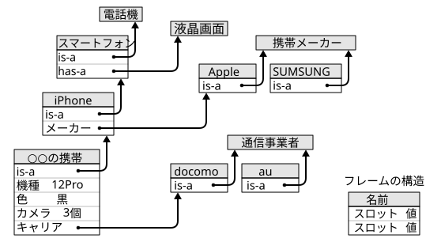

## 知識表現(5): 意味ネットワーク/フレーム

目次：

[TOC]

### 意味ネットワーク（§4.3）

意味ネットワークは，ネットワーク（ノード（節点，頂点）とリンク（矢線，有向辺）による構造，有向グラフとほぼ等価）による知識表現．ノードとリンクで何を表すかによってさまざまなスタイルがある．

- ノード

  - 事物（概念，個体）
  - 属性値
  - 出来事（エピソード）

- リンク … ノード間の関係

  - IS-A関係 … 「○○は××である」の関係

    - 概念の包含関係（下位概念-上位概念の関係）

      「ペンギンは鳥である」$(∀x(Penguin(x)→Bird(x)))$

    - 個体 (instance) と概念 (class) の関係

      「ピングーはペンギンである」$(Penguin(pingu))$

  - 部分-全体関係

    ※ 本来は個体間の関係だが，概念間の関係に抽象化できる．

    - PART-OF関係 …「○○は××の一部である」

      「腕は人体の一部である」

    - HAS-A関係 … 「○○は××を（部分として）持つ」

      ※ PART-OF の逆

      「人体は腕を（部分として）持つ」

  - 属性を表す関係（属性を持つ主体とその属性値との関係）

  - 格関係（命題に対する動詞，名詞等の関係）

#### 意味ネットワークにおける推論

リンクをたどる（検索する）ことにより行われる．例えば，上の図の例で，スズメ →  鳥 →  飛ぶ とたどることは，「スズメは鳥である」と「鳥は飛べる」から「スズメは飛べる」を推論すること（三段論法）に対応する．

#### 意味ネットワーク（概念階層表現）の特徴

- 概念間の階層関係と，概念同士の関係や概念の持つ属性を表現できる．

- 例外的な情報も記述できる．

  例えば，上の図の例では，動物一般は飛べないという知識を記述しているが，鳥は動物でも例外的に飛べるという知識を記述している．（さらに，ペンギンは鳥でも例外的に飛べないという知識を記述している）

- 人の連想をある程度模倣できる．

### フレーム

- 概念や事例（個体）を表現する枠組．
- 一つ一つの概念や事例に一つのフレームが対応する．個々のフレームには，
  - その概念や事例にかかわる一まとまりの知識
  - 他のフレーム（概念や事例）との関係にかかわる知識  
    （例えば，概念の階層構造（下位-上位関係）に関する知識など）

  が含まれる．

#### 「概念や事例」
- 概念 ＝ 集合としての「モノ」 → クラスフレーム
- 事例（個体）＝ 特定の「モノ」 → インスタンスフレーム

※ これらを区別しない立場もある

#### フレームの構造
- 名前： 他と識別するための記号[^1]．

[^1]: ここでいう「記号」は，いわゆる符号類（句読点，括弧，数学記号など）のことではなく，何らかの対象を識別するために，その対象に恣意的に結び付けられる番号や名前のこと．英語では symbol と呼ばれる．

- スロット： スロット名と値のペア ＋ その他の情報（デフォルト値など（後述））．
  - スロット名： スロットを識別するための記号[^1]．
  - 値： スロット名に対する値．
<!-- ※ メソッドのないオブジェクトに似ている（クラス・インスタンスは必ずしも区別しない） -->

#### スロットの値
- 数値，記号[^1]等の値をとり，そのフレームが表す概念や事例の特性を表す．
- 他のフレーム（へのリンク）を値とし，フレーム間の関係（そのフレームが表す概念や事例の間の関係）を表す．

#### スロットに付随する（こともある）その他の情報
  - デフォルト値： スロットの値が未知の時に，仮に用いられる値．典型的な値を用いることが多い．
  - 制約（許される値の種類・範囲・個数など）
  - 埋め込み手続き（デーモンと呼ばれる）
    - 要求駆動型（サーバント型）デーモン
      - そのスロットの値が参照されたときに実行される．
      - 例えば，未知のスロットの値が参照された時に呼び出され，その推定値を計算するなど．
    - データ駆動型（デーモン型）デーモン
      - そのスロットの値が設定・変更・削除されたときに実行される．

#### フレーム間の関係

- **is-a**： 概念 (class) 間の下位--上位の関係．概念階層を構成する．  
  　　　事例 (instance) と概念 (class) の間の関係にも用いられる．
  　　　継承（インヘリタンス）にかかわる．
- **has-a**，**part-of**： 全体--部分の関係を表す．
- その他，さまざまな関係がありうる．

※ 意味ネットワークにおけるリンクと類似している

#### 継承(インヘリタンス)について
**is-a**関係にある概念間において，下位の概念は上位の概念の特性を引き継ぐとみなすことができる．
その引き継ぎを*継承*と呼ぶ．
- 上位下位の連鎖関係にあるフレームにおいて，複数のフレームが同じ名前のスロットで
  異なる値を持つとき，あるフレームにおけるそのスロットの値は，自分自身を含む
  直近の上位のフレームのものを採用する．  
  （意味ネットワークの「動物」-「鳥」-「ペンギン」が「飛ぶ」かどうかの話を
  思い起こしてみよ）

#### フレームによる推論
- インヘリタンスを用いた推論  
  **is-a** の連鎖をたどって推論する（意味ネットワークと同様）．
- デフォルト値を用いた推論  
  未知の特性について，デフォルト値であると推論する（不確実）．
- デーモンを用いた推論

#### フレーム構造の例

#### 〔参考〕フレームを用いた言語理解

- ○○：「昨日携帯を iPhone に買い替えてん．」
  - 「○○の携帯」の事例フレームが作られる．
    - is-a スロットの値は iPhone になる．
    - 他のスロットの値は未知でなので空欄のままである．
      - 色は未知だが，「色」スロットのデフォルト値が「白」なら，必要な時には
        「白」とみなされる
    
  - 既存の知識から，「○○の携帯」のメーカーは Apple だとか，液晶画面を持っているとか，それは電話機であるとかは，言われなくてもすぐに理解できる．
  
- ○○：「思い切って黒い 12 Pro にしてん．」

  - 「○○の携帯」フレームの「色」スロットに黒が埋められる．  
    （デフォルト値を使う必要はなくなる．）
  - 「機種」スロットが「12 Pro」で埋められる．
    - iPhone 12 Pro はカメラが3個あるという知識（「機種」スロットのデータ駆動型デーモン）があれば，そのデーモンの実行によって「カメラ」スロットが「3個」で埋められる．

※ 典型的な（ありきたりな）内容は，大抵の場合，話者も省略するが，それらはデフォルト値で  
　 補っても，誤解を招くことは少ない（デフォルト値は典型的な値であるため）．
<!-- 
　 ← 典型性は，同一の文化において共有されているものなので，話者もそれを想定して，無意識  
　 　 に省略している．
 -->
※ 得られる情報が少ない時は，多くの欠損した情報がデフォルト値によって補われることになる．

