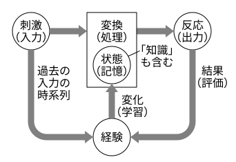

## 学習(1)：パーセプトロン

目次：

[TOC]

### 学習の心理学における定義

　学習とは刺激に対する反応が経験により（適応的に?）変化することである．

- 刺激 … 知覚，入力情報など

- 反応 … 行動，判断，出力情報など

- 経験 … 刺激の時系列（＋ 反応の結果）

  - 反応の結果 … 評価（報酬・ペナルティ）など

- 変化 … 状態（＝記憶）の変化（「知識」の変化を含む）

  

### さまざまな学習

- 知識の単なる暗記も，行動・判断に変化をもたらすなら，学習とみなせる．→ <u>暗記学習</u>
- 入力情報と記憶した知識を元に推論・抽象化 → 新たな知識の獲得（汎化） → <u>演繹的学習</u>・<u>帰納的学習</u>
- （あらかじめ用意した）入力に対して，その出力と（あらかじめ用意された）「正解」との誤差を最小化 → <u>教師あり学習</u>
- 入力データから，それらのデータの規則性や特徴等を見出す（知識? の獲得）→ <u>教師なし学習</u>
- 出力に対する報酬を最大化 → <u>強化学習</u>

※ 「変化」はすべて学習といえるか？ 「適応的に」変化するとはどういうことか？

### 機械学習

- ミッチェルの機械学習の定義 (T.M.Mitchell, 1997)

  〈T, P, E〉

  - T： タスク
  - P： パフォーマンス評価尺度
  - E： 経験

  P で測られる T の能力を，E を通じて向上させること．（単なる「変化」ではない）

### 代表的なタスク（§5.2）

- 識別（クラス分類）… 出力が質的データ

  入力データ群を正しく分類することが目標．

- 回帰 … 出力が量的データ

  入力に対して妥当な出力（行動・判断など）を与える関数の推定（近似）．予測にも用いられる．

- クラスタリング（§5.8）… 出力が質的データ

  識別と同様に入力データ群を分類するが，その分類するクラスも学習によって生成する（教師なし学習）．概念生成のモデルともみなせる．

※ データの種類（質的・量的）（§5.3）

- 質的（定性的）データ：数量化されていない．… 名義尺度，順序尺度．
- 量的（定量的）データ：数量化されている． … 間隔尺度，比例尺度．

※ 統計量や統計的な検定は，尺度の種類によって適用できるものが異なる．

### ニューラルネットワーク

多数のニューロセル（ユニット）を相互に結合したネットワーク．個々のニューロセルは（元々は）神経細胞の働きを模した単純な情報処理（計算）を行うが，それらを組み合わせることにより，複雑な情報処理を行う．

通常のプログラミングのような，手順を明示的に記述して行う情報処理（計算）とは大きく異なっている．

ニューロセル，および，それを用いた初期のニューラルネットワークモデルであるパーセプトロンについては，別途資料を用意しているので，そちらを参照していただきたい． 