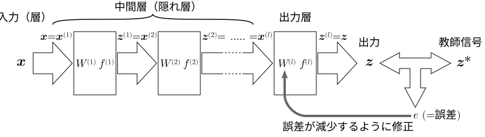
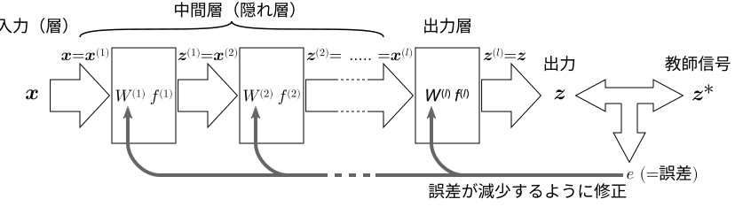
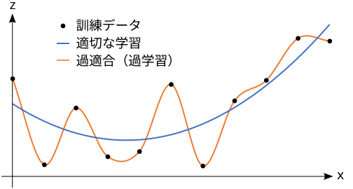

## 機械学習(2)：誤差逆伝播法

目次：

[TOC]

### フィードフォワード（ニューラル）ネットワーク (FNN)

複数入力複数出力の「層」を直列に（1方向に接続したネットワーク）

###### 

#### FNN のどこが良いのか

- 単層のネットワークでは解決できない線形分離問題（線形分離不可能な関数は学習できない問題）が解決できる（可能性がある）．
- 各層をある種の特徴抽出器と考えると，元データ ($\boldsymbol x$) の「低次」の特徴を統合して，徐々に「高次」の特徴を抽出していく仕組みができる（可能性がある）．

### パーセプトロン（復習）

- 複数層のフィードフォワードネットワーク（FNN）
- 訓練データ（入力ベクトル $\boldsymbol x$ と「正しい」出力ベクトル（教師信号）$\boldsymbol z^*$ の対を集めたもの）を用いて学習する．
  -  $\boldsymbol x$ を入力したときの実際の出力 $\boldsymbol z$ と教師信号 $\boldsymbol z^*$ の誤差を小さくするように，出力層の重み（バイアスを含む）を修正する．

###### 

#### 問題点

- 複数層のFNNであっても，学習できるのは最終層である出力層のみ．（それ以前の層（隠れ層＝中間層）はあらかじめ固定して作っておかねばならない）
- 隠れ層が固定されているため，運が悪ければ線形分離問題が解決できないかもしれない．
- 隠れ層が固定されているということは，「低次」の特徴抽出部分は学習できない．
- どうやってタスクに対して「最適」な隠れ層を構成するか？ （best ではなく better だとしても，適切な方法論がない）

### 誤差逆伝播法（バックプロパゲーション法，BP法）

出力の誤差が減少するように，隠れ層（中間層）も学習する手法．

###### 

#### 基本的なアイデア（最急降下法による学習）

- 誤差 $e$ を重み行列 $W^{(k)}$（の各成分 $w^{(k)}_{ji}$）の関数 $e=E(W^{(1)},\cdots,W^{(l)})$ と考える．

- 活性化関数 $(f^{(k)})$ を可微分なもの（シグモイド関数，正規化線形関数 (ReLU) など）にすることにより，誤差関数 $E$ も可微分とする．

- 誤差関数 $E$ を，重み行列の各成分 $w^{(k)}_{ji}$ について微分したときの偏微分係数 ${\frac{\partial E}{\partial w^{(k)}_{ji}}}$ を求める．

  - この偏微分係数は，$w^{(k)}_{ji}$ が微小に変化したときの $E$ の変化の割合（勾配）を表す．
  - ${\frac{\partial E}{\partial w^{(k)}_{ji}}}>0$ なら，$w^{(k)}_{ji}$ を小さくすると誤差 $e$ も小さくなる．
  - ${\frac{\partial E}{\partial w^{(k)}_{ji}}}<0$ なら，$w^{(k)}_{ji}$ を大きくすると誤差 $e$ が小さくなる．
  - 誤差が変化する程度は，${\frac{\partial E}{\partial w^{(k)}_{ji}}}$ の絶対値に比例する．

  なお，誤差関数 $E$ が可微分でない場合（例えば活性化関数がステップ関数の場合），$w^{(k)}_{ji}$ を多少変化させても，誤差 $e$ は変化しない．（あるしきい値を超えた瞬間に，不連続に変化する）

- 重み行列の各成分 $w^{(k)}_{ji}$ の，学習における修正量 $Δw^{(k)}_{ji}$ を，この偏微分係数に比例するように決定する．
  $$
  Δw^{(k)}_{ji}=-λ\frac{\partial E}{\partial w^{(k)}_{ji}}\quad(λ\text{ は学習係数})
  $$

  - 各 $w^{(k)}_{ji}$ を軸とする多次元空間（ものすごい高次元！）において，もっとも勾配の大きい「方向」へ修正することになる（＝<u>最急降下法</u>）．

- なお，このアイデア自体は従来からあったが，各 $w^{(k)}_{ji}$ に対する誤差関数 $E$ の偏微分係数 ${\frac{\partial E}{\partial w^{(k)}_{ji}}}$ を求める効率的な手段がなかった．誤差逆伝播法は，この計算を効率よく行う手法である．

#### 〔参考〕誤差逆伝播法による偏微分係数の計算

- 最急降下法において必要になる偏微分係数 ${\frac{\partial E}{\partial w^{(k)}_{ji}}}$ は，$u^{(k)}_j$（第 $k$ 層の第 $j$ セルの活性値）と $x^{(k)}_i$（第 $k$ 層の $i$ 番目の入力）を用いて以下のように表せる（証明は省略．そういうもんだと思ってください）．
  $$
  \frac{\partial E}{\partial w^{(k)}_{ji}}
  = \frac{\partial E}{\partial u^{(k)}_j}\cdot x^{(k)}_i
  $$

- この ${\frac{\partial E}{\partial u^{(k)}_j}}$ は， ${\frac{\partial E}{\partial u^{(k+1)}_1}},\ {\frac{\partial E}{\partial u^{(k+1)}_2}\cdots}$ （第 $k+1$ 層の各セルの活性値）から計算できる．すなわち，$k$ が減少する方向（$k+1$ から $k$ ）への漸化式[^1]で計算できる．これが誤差「逆伝播」法という名称の由来．（これが誤差逆伝播法のキモ）

- この漸化式を用いて出力層から入力方向へ向かって，効率よく ${\frac{\partial E}{\partial u^{(k)}_j}}$ を計算し，それらからさらに ${\frac{\partial E}{\partial w^{(k)}_{ji}}}$ ，$Δw^{(k)}_{ji}$ を計算して，最急降下法を用いる．

#### 誤差逆伝播法の問題点

- 局所解問題
  - 極小点（局所解）で学習が止まる可能性がある ＝ 最適解が得られるとは限らない．（最急降下法全般の問題）
- 勾配消失問題
  - 偏微分係数が $0$ に近いと，各重み成分の修正量 $Δw^{(k)}_{ji}$ が小さくなり，学習がなかなか進まない．
  - かといって，学習係数を大きくしすぎると，解を飛び越えてなかなか収束しなくなる可能性がある．
  - 出力層から遠い（入力に近い）層ほど深刻．（ $w^{(k)}_{ji}$ が出力に及ぼす影響が相対的に小さい）

###### 

- 過適合（オーバーフィッティング，過学習）問題
  - 訓練パターンに過度に最適化されて一般性を損なう．

###### 

#### …その解決

- 局所解問題
  - 異なった初期状態で何度か実行するなど．
  - 「何もしない」（ほとんどの場合，局所解であっても最適解に近い値になるという報告もあるらしい）．
  <!-- 
    - 確率的な動作を導入する．（<u>シミュレーテッド・アニーリング（焼きなまし法）</u>など）
  -->
- 勾配消失問題

  - 活性化関数の勾配が関連しているので…

    - 活性化関数を工夫する（シグモイド関数はあまりよくない（絶対値が大きいところの勾配が小さい）ので，<u>ReLU</u>などが良く用いられる）．

  - 入力に近い層は別の方法で学習する

    - <u>自己符号化器（autoencoder; オートエンコーダ）</u>による事前学習（次回説明の予定）
    - <u>転移学習</u> ― 他で学習したものを流用する

- 過適合問題

  - 学習をやめるタイミングを見計らって，適当なところで学習を打ち切る．

    - 訓練データとは独立にテストデータを用意して，時々テストデータで成績（誤差）をチェックする．テストデータの成績が悪化し始めたら，学習を打ち切る．

  - パラメータ（重み $w^{(k)}_{ji}$）が多すぎる（FNNが柔軟すぎる）のが原因の1つなので…

    - パラメータ（$w^{(k)}_{ji}$）を実質的に減らすために，$w^{(k)}_{ji}$ を $0$ に近づけるように圧力をかける．  
      ＝ 誤差関数に<u>正則化項</u>（パラメータ $w^{(k)}_{ji}$ の二乗和に係数をかけたものなど）を加える．

  - タスクの性質に応じて，いくつかの層で，重みパラメータ $w^{(k)}_{ji}$ を複数個所で共有するような規則的なネットワーク構成を用いて，実質的にパラメータを減らす．

    - 例えば，画像処理に特化した<u>畳み込みニューラルネットワーク (Convolutional Neural Network; CNN)</u>[^2]など．
  - ドロップアウト：学習の反復時，各層でユニットをランダムに選んで出力を強制的に
    0 にする．(出力線を一時的に切断するのと等価)
    - 入力層：𝑝=20% 程度，隠れ層：𝑝=50% 程度．
    - 出力を 0 にされたユニットは学習されない．
    - 推論時は 0 にせず，出力に 1−𝑝 を掛けて調整する．
    - 個別に学習された部分ネットワークの多数決をとるのと似た感じになる．

[^1]:実際の漸化式は
$$\displaystyle{\frac{\partial E}{\partial u^{(k)}_j}=f^{(k)\prime}(u^{(k)}_i)}\cdot\sum_h w^{(k+1)}_{hi}\frac{\partial E}{\partial u^{(k+1)}_h}$$
[^2]:画像処理においては，画像の局所的な特徴抽出の仕方は視野のどこであっても大きな違いがないことも多い．そのため，畳み込みニューラルネットワークでは，その局所的な特徴抽出を行う小さな領域を画面全体に配置して，それらの重みパラメータ $w^{(k)}_{ji}$ を共通にすることで，パラメータ数を実質的に減らしている．