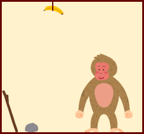

<style>
pre.code {
    padding: 8px 4px 6px 12px;
    font-size: 80%;
    background-color: rgb(248, 248, 248);
    border: rgb(231, 234, 237) solid 1px;
    border-radius: 3px;
}
</style>
## プロダクション・システムの例

お腹が空いた猿の行動シミュレーション？！

- WM（ワーキングメモリ）要素

  - 述語記号と対象表現のリスト  
     `(述語 対象表現1 対象表現2 ……)` で表す．
  - 対象は，対象を表す記号 `対象記号` か，  
    対象の表現に修飾語（記号）を付けたもの  
     `(修飾語 対象表現)` で表す．
  
  例：
  
  - `(床上 バナナ)`： 床上にバナナがある．
  - `(持つ 右手 棒)`： 右手に棒を持っている．
  - `(持つ 左手 (皮 バナナ))`： 左手に皮になったバナナ（バナナの皮）を持っている．
  
- プロダクションルール

  - `ルール名[引数]： 条件部 → 実行部.` という形で表す．
  - `引数` は，*変数*をコンマで区切った並びで表す．
  - `条件部`，`実行部` は，いずれもWM要素の並びで表す．
  - `条件部`，`実行部` に含まれる変数は，引数で与えられた対象表現が代入されて用いられる．
    - `nil` は「空」「無」を表す特別な値で，変数に代入することはできない．
  - （代入後の）`条件部` に含まれるWM要素の全てがWMに含まれている場合，条件が満たされたとみなされ，その（代入された）ルールは実行可能となる．
  - （代入された）ルールが実行された場合，WMから，そのルールの `条件部` に含まれるWM要素をすべて取り除いた後，`実行部` に含まれるWM要素をすべて追加する．
    -  `条件部` と `実行部` の両方に含まれるWM要素は，削除された後にまた追加されるので，削除されなかったのと同じことになる．
  - （ルールの先頭に，コロンをはさんで正の整数値で優先度を与えることもできる．（優先度のないものは優先度 0 と考える））

- プロダクション・ルールの集合（例）

  ```lisp
  ; 停止のためのルール（以下 ；から行末まではコメントを表す）
  停止[]: (満腹) → (満腹) (stop).
  
  ; 「h に持っている剥いたバナナを食べる」h は左右どちらかの手を表す．
  バナナを食う[h]: (空腹) (持つ h (剥いた バナナ)) → (満腹) (持つ h (皮 バナナ)).
  
  ; 「h1 に持っているバナナを h2 で剥く」h1, h2 は，いずれも左右どちらかの手を表す．
  バナナを剥く[h1, h2]:
  　　(持つ h1 バナナ) (持つ h2 nil) → (持つ h1 (剥いた バナナ)) (持つ h2 nil).
  
  ; 「h に持っている棒で，天井にある x を落とす」h は左右どちらかの手，x は物を表す．
  落とす[h, x]: (天井 x) (持つ h 棒) → (床上 x) (持つ h 棒).
  
  ; 「h に持っている x を手放す」h は左右どちらかの手，x は物を表す．
  手放す[h, x]: (持つ h x) → (床上 x) (持つ h nil).
  
  ; 「h で x を拾う」h は左右どちらかの手，x は物を表す．
  拾う[h, x]: (床上 x) (持つ h nil) → (持つ h x).
  ```

- WM（ワーキングメモリ）

  - WM要素が（左から右へ）一列に並んでいると考える．
  - WM要素を追加するときは，常に末尾（右端）に追加する．  
    （結果として，古くからWM中にあるWM要素ほど，先頭（左端）に近いことになる）

- 競合解消の戦略

  - 優先度の大きいルールを優先する．
  - (優先度が同じルールについては，) 上(先)にあるルールを優先する．（*Ordered*）
  - 同じルールの適用が複数パターンある場合：

    - 条件部の最初のWM要素にマッチするWM要素が，WM中で最も先頭に近いもの（左または上にあるもの）を選ぶ．
    - 上のWM要素が同じなら，条件部の2つ目のWM要素にマッチするWM要素が，WM中で最も先頭に近いもの（左にあるもの）を選ぶ．

    　…

    以下同様にして優先順位を定める．（*LRU*)

- WM の初期状態
  ```lisp
  (空腹) (持つ 右手 nil) (持つ 左手 nil) (床上 石) (床上 棒) (天井 バナナ)
  ```

- WM の目標状態

  - `(stop)` が WM 中にある（実行を停止する）．

- 動作例： （WM の状態と適用されるルールを交互に示す）

  （https://wwws.kobe-c.ac.jp/~miura/stock/ape/ape.html で実行できるので試してみよう．  
  　[パターン照合] と [競合解消・右辺実行] を交互にクリックすると実行できる．）

  <pre class="code">
  <strong> 0. (空腹) (持つ 右手 nil) (持つ 左手 nil) (床上 石) (床上 棒) (天井 バナナ)</strong>
     ↓ 拾う[右手, 石]: (床上 石) (持つ 右手 nil) → (持つ 右手 石).
  <strong> 1. (空腹) (持つ 左手 nil) (床上 棒) (天井 バナナ) (持つ 右手 石)</strong>
     ↓ 手放す[右手, 石]: (持つ 右手 石) → (床上 石) (持つ 右手 nil).  
  <strong> 2. (空腹) (持つ 左手 nil) (床上 棒) (天井 バナナ) (床上 石) (持つ 右手 nil)</strong>  
     ↓ 拾う[左手, 棒]: (床上 棒) (持つ 左手 nil) → (持つ 左手 棒).  
  <strong> 3. (空腹) (天井 バナナ) (床上 石) (持つ 右手 nil) (持つ 左手 棒)</strong>
     ↓ 落とす[左手, バナナ]: (天井 バナナ) (持つ 左手 棒) → (床上 バナナ) (持つ 左手 棒).  
  <strong> 4. (空腹) (床上 石) (持つ 右手 nil) (床上 バナナ) (持つ 左手 棒)</strong>
     ↓ 手放す[左手, 棒]: (持つ 左手 棒) → (床上 棒) (持つ 左手 nil).  
  <strong> 5. (空腹) (床上 石) (持つ 右手 nil) (床上 バナナ) (床上 棒) (持つ 左手 nil)</strong>  
     ↓ 拾う[右手, 石]: (床上 石) (持つ 右手 nil) → (持つ 右手 石).  
  <strong> 6. (空腹) (床上 バナナ) (床上 棒) (持つ 左手 nil) (持つ 右手 石)</strong>
     ↓ 手放す[右手, 石]: (持つ 右手 石) → (床上 石) (持つ 右手 nil).  
  <strong> 7. (空腹) (床上 バナナ) (床上 棒) (持つ 左手 nil) (床上 石) (持つ 右手 nil)</strong>  
     ↓ 拾う[左手, バナナ]: (床上 バナナ) (持つ 左手 nil) → (持つ 左手 バナナ).  
  <strong> 8. (空腹) (床上 棒) (床上 石) (持つ 右手 nil) (持つ 左手 バナナ)</strong>
     ↓ バナナを剥く[左手, 右手]:
     ↓     (持つ 左手 バナナ) (持つ 右手 nil) → (持つ 左手 (剥いた バナナ)) (持つ 右手 nil).
  <strong> 9. (空腹) (床上 棒) (床上 石) (持つ 左手 (剥いた バナナ)) (持つ 右手 nil)</strong>
     ↓ バナナを食う[左手]: (空腹) (持つ 左手 (剥いた バナナ)) → (満腹) (持つ 左手 (皮 バナナ)).  
  <strong>10. (床上 棒) (床上 石) (持つ 右手 nil) (満腹) (持つ 左手 (皮 バナナ))</strong>
     ↓ 停止[]: (満腹) → (満腹) (stop).  
  <strong>11. (床上 棒) (床上 石) (持つ 右手 nil) (持つ 左手 (皮 バナナ)) (満腹) (stop)</strong>
  </pre>

### プロダクション・ルールの一般化の例

- 例えば，*バナナを食う[h]* というルールは，バナナを変数に置き換えることにより，*果物を食う[h, x]* というルールを構成できる．

  ```lisp
  ; h に持っている剥いた果物 x を食べる
  果物を食う[h, x]: (持つ h (剥いた x)) (空腹) → (持つ h (皮 x)) (満腹).
  ```

### プロダクション・ルールの統合の例

- 例えば，上の動作例の **7.** ～ **10.** で用いられた，*拾う[h, x]*，*バナナを剥く[h1, h2]*，*バナナを食う[h]* の3つのルールを統合して，*バナナを拾って剥いて食う[h1, h2]* というルールを構成できる．

  <pre class="code">
  <strong>(空腹) (床上 バナナ) (持つ h1 nil) (持つ h2 nil)</strong>  
     ↓ 拾う[h1, バナナ]: (床上 バナナ) (持つ h1 nil) → (持つ h1 バナナ).  
  <strong>(空腹) (持つ h2 nil) (持つ h1 バナナ)</strong>
     ↓ バナナを剥く[h1, h2]:
     ↓     (持つ h1 バナナ) (持つ h2 nil) → (持つ h1 (剥いた バナナ)) (持つ h2 nil).
  <strong>(空腹) (持つ h1 (剥いた バナナ)) (持つ h2 nil)</strong>
     ↓ バナナを食う[h1]: (空腹) (持つ h1 (剥いた バナナ)) → (満腹) (持つ h1 (皮 バナナ)).  
  <strong>(持つ h2 nil) (満腹) (持つ h1 (皮 バナナ))</strong>
  </pre>
  より．以下のルールが生成できる．
  
  ```lisp
  ; h1 でバナナを拾い，h2 で剥いて食べる．
  バナナを拾って剥いて食う[h1, h2]:
      (空腹) (床上 バナナ) (持つ h1 nil) (持つ h2 nil)
          → (持つ h2 nil) (満腹) (持つ h1 (皮 バナナ)).
  ```
  
- このルールを用いると，より少ない手順で目標に到達できる．

### 試してみよう

- https://wwws.kobe-c.ac.jp/~miura/stock/ape/ape.html では，プロダクションメモリもワーキングメモリも書き換えて実行することができる．
  - [Edit]：書き換えが可能な状態にする．（この状態では，実行はできない）
  - [Save]：書き換えを確定して実行可能な状態にする．
  - [Cancel]：書き換えを無効にし，書き換え前の状態に戻して，実行可能な状態にする．
  - [Reset]：初期状態（最初にページを開いたときの状態）に戻す．
- 以下を試してみよう．
  1. プロダクションメモリの *バナナを食う[h]* ルールを，上の *果物を食う[h, x]* ルールに置き換えて実行してみる．
  2. プロダクションメモリの最初に，上の *バナナを拾って剥いて食う[h1, h2]* ルールを追加して実行してみる．（注：最初に置いたルールは最優先のルールになる）
  3. プロダクションメモリのルールの順序を変えてみる（例えば，*手放す[h, x]* と *拾う[h, x]* の順序を入れ替えてみるなど）
  4. ワーキングメモリのWM要素の順序を変えてみる（例えば (床上 石) と (床上 棒) を入れ替えてみるなど）

