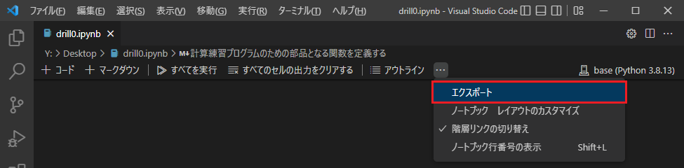
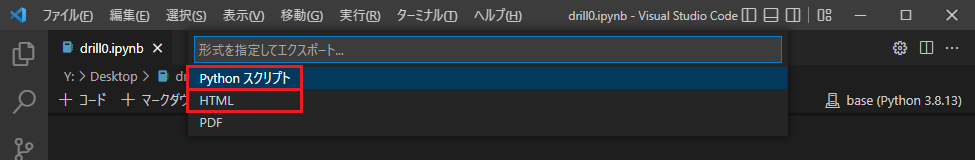
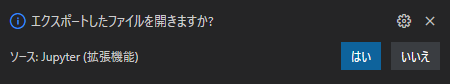

# Jupyterノートブック形式（.ipynb）の エクスポート

Visual Studio Code で，Jupyterノートブック形式（.ipynb）のファイルから
Python のコードを抽出したり，HTML 形式に変換したりできる．以下の手順で行う．

1. 上のタブの下のメニューの右端の三点メニューから，「**エクスポート**」を選ぶ．  
   

1. 表示された選択肢から，エクスポートする形式を選ぶ．  
   

   -  Python コードのファイルを抽出するには，「**Python スクリプト**」を選ぶ．
      -  生成されたタブの内容を，Python ファイルとして，適当な場所に適当な名前で保存する．
      -  拡張子は .py とする．

      ※ コードセル以外の部分は，コメントとして残されているので，適宜編集してもよい．
   -  HTML 形式に変換する場合は「**HTML**」を選ぶ．
      -  エクスポートが完了すると「名前を付けて保存」のウィンドウが開くので，
         適当な場所に適当な名前で保存する．
      -  保存後，右下で「エクスポートしたファイルを開きますか?」と聞いてくる．
         「はい」を選ぶとブラウザに表示されるので，すぐに内容を確認したい場合や印刷したい場合は「はい」を選ぶとよい．
         